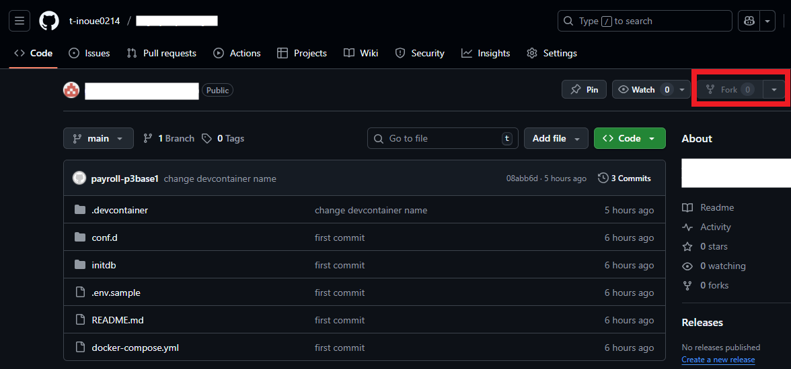
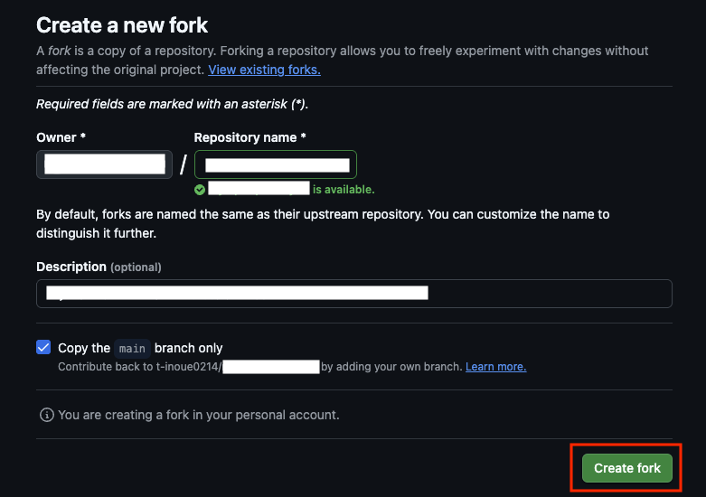
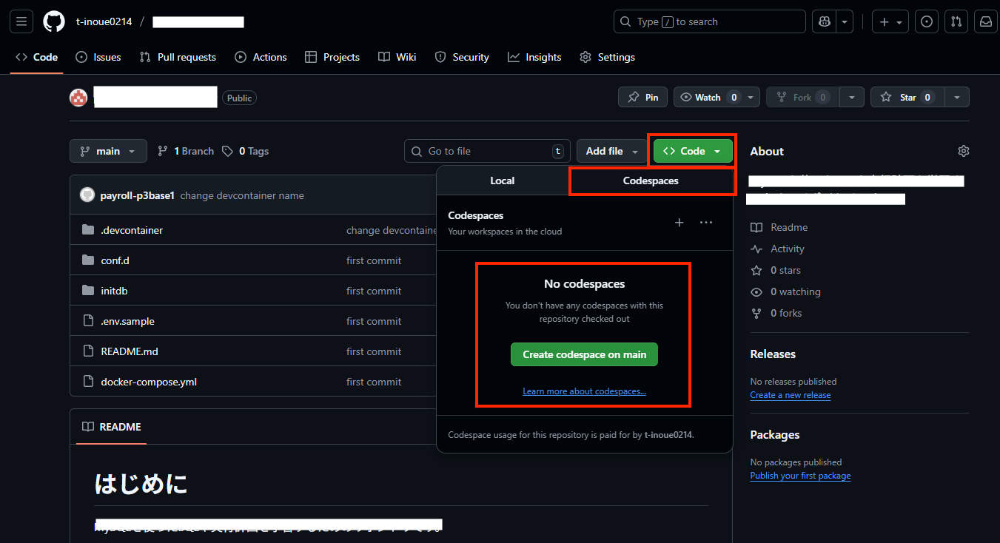
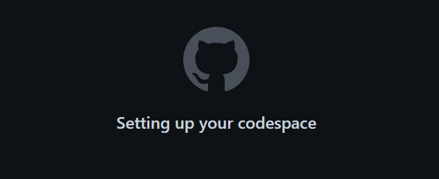
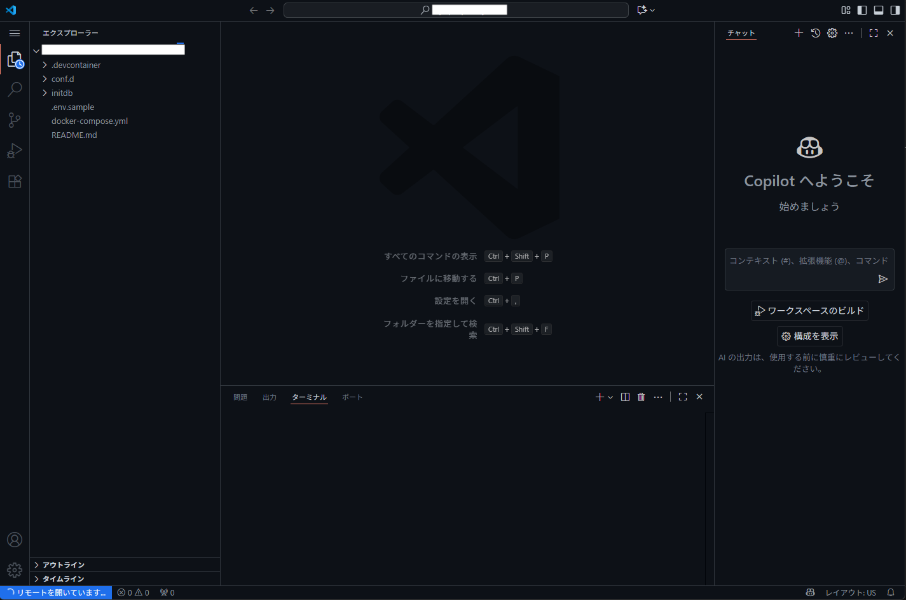
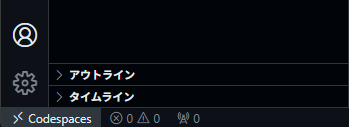
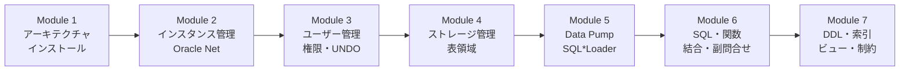

# starter-oracle-db

Oracle DB が学習できる環境を提供するため作成しました。

環境構築不要！ブラウザだけで学べる Oracle Database Silver DBA 習得講座へようこそ。

このリポジトリは、**GitHub Codespaces** を使って、Java 開発経験のある新卒エンジニアが Oracle Database の DBA 基礎を実体験を通じて学べるように作っています。

> **⚠️ 学習上の重要ルール**
> [Oracle Database 21c ドキュメント](https://docs.oracle.com/en/database/oracle/oracle-database/21/index.html) の情報が「最新かつ正確」な一次情報です。
> ここで記載した内容や、もし AI から回答を得た場合であっても、**必ず公式ドキュメントを確認しながら学習する癖** をつけてください。

---

## 💻 1. 開発環境 (Development Environment)

この勉強会では **GitHub Codespaces** を使用します。

面倒な環境構築は不要です。ブラウザさえあれば、すぐに学習を始められます。

1. **GitHubにログイン** してください（アカウントがない場合は作成してください）。

1. このリポジトリをフォークするため、右上の`fork`をクリックする。

    

1. `Create fork`ボタンをクリックして、フォーク（自分のアカウントにコピーして新しいリポジトリを作成）する。

    

1. `Codespace`を起動するため、`Code`タブに移動し、右上にある緑色の`code`のプルダウンメニューを開き、`Codespace`タブを開き、`Create codespace on main`をクリックする。

    

1. `Codespace`の生成にはしばらく時間がかかるため、しばらく待つ。

    

1. `VSCode`が起動するが、画面左下が`リモートを開いています...`の間は待つ。

    

1. 画面左下が`Codespace`になった場合は、`Codespace`が起動完了しました

    

環境が立ち上がったら、左側のファイル一覧から学習したい章のフォルダを開いてください。

> **💡 Oracle Database のインストールについて**  
> Codespace 起動直後は OS（Oracle Linux 8）のみ起動した状態です。  
> Oracle Database 21c XE のインストールは、Module 1 の実習として自分の手で行います。これが最初の学習ステップです。

### Codespaces利用上の注意

- `Github`の`Codespaces`を利用する。`Codespaces`は設定によってはコストがかかるため、[Codespace の利用上の注意](./CODE_SPACES_SERVICE.md) はよく確認すること。
- コストをかけないためにも、セキュリティの意味でも、使い終わったら [停止方法](./CODE_SPACES_SERVICE.md#3-停止方法) に従って停止することを推奨する。

---

## 🚀 2. 学習の始め方

1. **Codespaces を起動**
    - フォーク済みの自分のリポジトリで、`Code` タブ → `Codespaces` タブ → `Create codespace on main` をクリックする。
    - 起動手順の詳細は [1. 開発環境](#-1-開発環境-development-environment) を参照。

1. **環境の準備を待つ**
    - ブラウザでVS Codeが起動する。
    - 初回は Oracle Linux 8 のセットアップのために数分かかる。
    - 左下のステータスバーなどが落ち着くまで少し待つ。

1. **学習スタート！**
    - 左側のファイル一覧から `module-01/` （Module 1）のフォルダを開く。
    - `README.md` をクリックして開き、解説を読みながら進める。
    - `README.md` を右クリックして「プレビューを開く (Open Preview)」を選ぶと読みやすくなる。

---

## 📚 3. この講座で学ぶこと

この講座は全7モジュール（23章）で構成されています。モジュールごとにフォルダ（`module-XX/`）が分かれているので、順番に進めてください。

| モジュール | 対象章 | タイトル | 学ぶ内容 |
| :--- | :--- | :--- | :--- |
| **Module 1** | 第1・2章 | データベースの心臓部を知る | アーキテクチャ、インストール、DBCA |
| **Module 2** | 第3・4章 | インスタンスと接続の制御 | 起動・停止、初期化パラメータ、Oracle Net |
| **Module 3** | 第5・8章 | 守りとセキュリティ | ユーザー管理、権限・ロール、UNDO管理 |
| **Module 4** | 第6・7章 | データの器（ストレージ）管理 | 表領域、データファイル、セグメント構造 |
| **Module 5** | 第9章 | データの搬入・搬出 | Data Pump、SQL\*Loader、外部表 |
| **Module 6** | 第10〜18章 | 開発者の一歩先を行くSQL | 標準SQL、関数、結合、副問合せ、DML |
| **Module 7** | 第19〜23章 | オブジェクトの最適化と整合性 | DDL、索引、ビュー、シーケンス、制約 |

この7つのモジュールは **「DB の土台 → 管理 → SQL 活用」** という流れで設計されています。
Java 開発者が本番障害に直面したとき、その原因の多くは DB 設計・権限設定・インデックス不足にあります。
DBA の視点を持つことで、アプリケーション開発全体の品質が向上します。

---

## ⚙️ 4. 動作環境 (Tech Stack)

この講座は以下の環境で動作するように設定されています（自動構築されます）。

- **OS:** Oracle Linux 8
- **データベース:** Oracle Database 21c XE (SID: XE)
- **ツール:** SQL\*Plus, lsnrctl, adrci, PFILE/SPFILE
- **エディタ:** VS Code (Codespaces) 上に Oracle SQL Developer / YAML 用の拡張機能を事前インストール済み

---

## 📝 重視する思想

このリポジトリでは、「実際に手を動かしてみる」ことを何より重視しています。

エンジニアの技術は、資料を読むだけで覚えたり、理解したりすることは難しいものです。

例えば、自動車教習所の教本を完璧に暗記したとしても、それだけで実際に車を運転できるようにはなりませんよね？

ハンドルを握り、アクセルを踏むという「実体験」がなければ、運転技術は身につきません。

ソフトウェア技術も同じです。

技術的な仕組みを知ることも大切ですが、実際に実行した経験こそが現場で役立ちます。

読むだけで終わらせず、ぜひご自身の手で実行してみてください。
