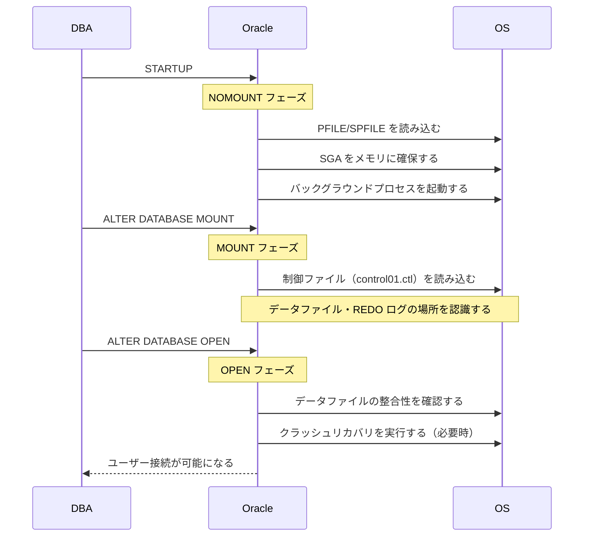
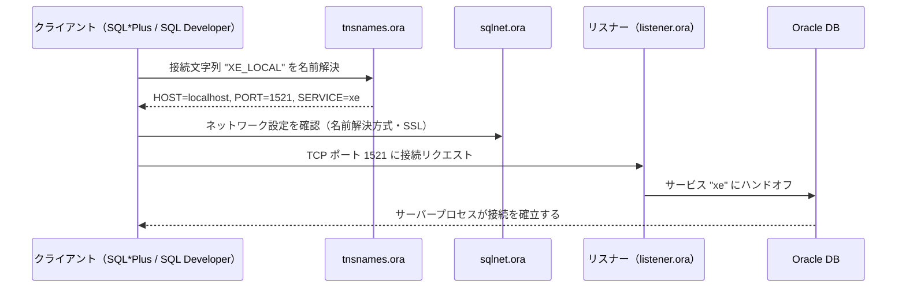

# Module 2: インスタンスと接続の制御

Oracle DBA として最も頻繁に行う操作が「データベースの起動・停止」と「接続の管理」です。
このモジュールでは、インスタンスが起動する仕組み（NOMOUNT → MOUNT → OPEN の3フェーズ）と、
外部からの接続を制御する Oracle Net の設定方法を実機で体験します。

## 学習目標

- STARTUP の3フェーズ（NOMOUNT/MOUNT/OPEN）を説明できる
- SHUTDOWN の4オプション（NORMAL/IMMEDIATE/TRANSACTIONAL/ABORT）を使い分けられる
- PFILE と SPFILE の違いを理解し、相互変換できる
- `ALTER SYSTEM SET` で初期化パラメータを動的変更できる
- `v$parameter` で現在のパラメータ値を確認できる
- Oracle Net の3ファイル（listener.ora/sqlnet.ora/tnsnames.ora）の役割を説明できる
- `lsnrctl` コマンドでリスナーを操作できる

## 第3章: インスタンスの起動と停止

### STARTUP の3フェーズ

Oracle を `STARTUP` コマンドで起動すると、内部的に3つのフェーズを順番に通過します。
各フェーズは単なる通過点ではなく、それぞれの段階でしか実行できない DBA 作業があります。



| フェーズ | 読み込むもの | 使える主なビュー | DBA 作業例 |
| :--- | :--- | :--- | :--- |
| NOMOUNT | パラメータファイル | `v$parameter`, `v$sga` | データベースの新規作成（CREATE DATABASE） |
| MOUNT | 制御ファイル | `v$controlfile`, `v$logfile`, `v$datafile` | 制御ファイルの再作成、アーカイブ設定変更 |
| OPEN | データファイル | すべての `v$` ビュー、ユーザー表 | 通常の業務・管理作業 |

> **なぜフェーズを分けるのか**
>
> データベースが完全に開く前でも「制御ファイルだけを参照したい」「パラメータを変えて再起動したい」
> といった管理作業が必要になります。段階的にアクセス範囲を広げることで、安全にメンテナンスができます。

### SHUTDOWN の4種類

| オプション | 接続中ユーザー | 未コミットトランザクション | 使いどころ |
| :--- | :--- | :--- | :--- |
| `NORMAL` | 全員が自発的に切断するまで待つ | ロールバックしてから終了 | 停止を急がない場合（実際はほぼ使わない） |
| `TRANSACTIONAL` | トランザクション完了後に切断する | コミット済みのものは保持 | 実行中のトランザクションを尊重したい場合 |
| `IMMEDIATE` | 強制切断する | 全ロールバック | 通常のメンテナンス停止（これを使うことが多い） |
| `ABORT` | 強制切断する | ロールバックしない（次回起動時にリカバリ） | OS 障害に近い状態。次回起動が遅くなる |

> **SHUTDOWN ABORT を避ける理由**
>
> ABORT はデータファイルと REDO ログの整合性が取れていない状態で停止します。
> 次回 OPEN 時に SMON がクラッシュリカバリを行うため起動に時間がかかります。
> Oracle が正常に動作している場合は `SHUTDOWN IMMEDIATE` を使ってください。

## 第4章: 初期化パラメータと Oracle Net

### PFILE と SPFILE

Oracle インスタンスは起動時にパラメータファイルを読み込み、SGA サイズやプロセス数を決定します。
パラメータファイルには2種類あります。

| 種別 | ファイル名 | 形式 | 変更方法 | 変更の適用 |
| :--- | :--- | :--- | :--- | :--- |
| PFILE | `initXE.ora` | テキスト（手動編集可） | OS 上でテキストエディタを使う | 次回起動時 |
| SPFILE | `spfileXE.ora` | バイナリ（直接編集不可） | `ALTER SYSTEM SET` コマンド | 即時・次回起動時・両方を選択できる |

> **普段は SPFILE を使う**
>
> SPFILE は `ALTER SYSTEM SET` で変更履歴が管理され、誤ったパラメータも `SCOPE=SPFILE` なら
> インスタンスを止めずに訂正できます。PFILE はトラブル対応（SPFILE が破損した場合など）の
> バックアップとして使います。

#### 主要初期化パラメータ（XE の実環境値）

| パラメータ | 値 | 説明 |
| :--- | :--- | :--- |
| `sga_target` | 1536M | SGA 全体のターゲットサイズ（自動メモリ管理） |
| `pga_aggregate_target` | 512M | PGA の集約ターゲット |
| `processes` | 320 | 同時 OS プロセス数の上限 |
| `sessions` | 504 | 同時セッション数の上限（processes の約1.5倍） |
| `control_files` | control01.ctl, control02.ctl | 制御ファイルのパス（2本でミラーリング） |
| `undo_management` | AUTO | UNDO 管理方式（自動） |
| `enable_pluggable_database` | TRUE | マルチテナント（CDB/PDB）が有効 |

#### ALTER SYSTEM SET の SCOPE 指定

| SCOPE | 即時反映 | SPFILE 書き込み | 説明 |
| :--- | :---: | :---: | :--- |
| `MEMORY` | ○ | ✕ | 今すぐ変更するが再起動後は元に戻る |
| `SPFILE` | ✕ | ○ | 次回起動時から有効（静的パラメータに使う） |
| `BOTH` | ○ | ○ | 今すぐ + 再起動後も継続（動的パラメータに使う） |

### Oracle Net の3ファイル

Oracle Net は「クライアントがどのデータベースにどうつながるか」を管理する仕組みです。
設定ファイルは3種類で、それぞれ役割が異なります。



| ファイル | 場所 | 役割 |
| :--- | :--- | :--- |
| `listener.ora` | サーバー側 | リスナーの待受プロトコル・ポート・Wallet パスを定義する |
| `sqlnet.ora` | サーバー／クライアント側 | 名前解決方式・SSL バージョン・Wallet の場所を定義する |
| `tnsnames.ora` | クライアント側 | 接続文字列（別名）を `(DESCRIPTION=...)` 形式で定義する |

> **この環境の listener.ora について**
>
> `generate-wallet.sh` が listener.ora を書き換え済みのため、TCP 1521（通常接続）と
> TCPS 2484（SQL Developer Wallet 接続）の両方が設定されています。
> `lsnrctl status` で両エンドポイントが表示されることを Step 7 で確認します。

## ハンズオン

### Step 1: 現在のインスタンス状態を確認する

```bash
sqlplus / as sysdba
```

```sql
SELECT instance_name, status, database_status FROM v$instance;
```

`STATUS` が `OPEN`、`DATABASE_STATUS` が `ACTIVE` と表示されれば正常に動作しています。

---

### Step 2: SHUTDOWN IMMEDIATE → STARTUP NOMOUNT

データベースを停止し、最初のフェーズ（NOMOUNT）で止めます。

```sql
SHUTDOWN IMMEDIATE;
STARTUP NOMOUNT;
```

NOMOUNT 中は制御ファイルを読んでいないため、通常のユーザー表にはアクセスできません。
しかし `v$parameter` でパラメータファイルの内容は参照できます。

```sql
SELECT name, value FROM v$parameter WHERE name = 'db_name';
```

---

### Step 3: ALTER DATABASE MOUNT

制御ファイルを読み込み、データベースの物理構造（データファイルの場所など）を認識させます。

```sql
ALTER DATABASE MOUNT;
```

MOUNT 状態になると、制御ファイルに記録された情報が参照できます。

```sql
-- 制御ファイルの場所を確認する
SELECT name FROM v$controlfile;
-- → /opt/oracle/oradata/XE/control01.ctl と control02.ctl の2ファイルが表示される

-- REDO ログファイルを確認する
SELECT group#, member FROM v$logfile ORDER BY group#;
-- → 3グループ（redo01.log / redo02.log / redo03.log）が表示される
```

---

### Step 4: ALTER DATABASE OPEN

データファイルの整合性を確認し、ユーザーが接続できる状態にします。

```sql
ALTER DATABASE OPEN;
SELECT status FROM v$instance;
```

`STATUS` が `OPEN` になっていれば成功です。

---

### Step 5: PFILE の書き出しと内容確認

現在の SPFILE の内容をテキスト形式（PFILE）に書き出します。
SPFILE はバイナリのため直接読めませんが、PFILE に変換することで設定内容を確認できます。

```sql
CREATE PFILE='/tmp/init_xe_export.ora' FROM SPFILE;
```

ターミナルを別タブで開き、生成されたファイルを確認します。

```bash
cat /tmp/init_xe_export.ora
```

`*.sga_target`、`*.processes` などのパラメータが確認できます。

---

### Step 6: 初期化パラメータの動的変更

`sessions` パラメータを変更して SCOPE の動作を体験します。

```sql
-- 現在値を確認する
SELECT value FROM v$parameter WHERE name = 'sessions';
-- → 504

-- SPFILE にのみ書き込む（次回起動時に有効）
ALTER SYSTEM SET sessions=510 SCOPE=SPFILE;

-- 現在のセッション値はまだ変わっていない（SPFILE のみ変更されたため）
SELECT value FROM v$parameter WHERE name = 'sessions';
-- → まだ 504

-- 元の値に戻す
ALTER SYSTEM SET sessions=504 SCOPE=SPFILE;
```

---

### Step 7: リスナーの状態を確認する

```bash
lsnrctl status
```

以下の2つのエンドポイントが表示されることを確認します。

- `(PROTOCOL=tcp)(PORT=1521)` — 通常の SQL\*Plus 接続
- `(PROTOCOL=tcps)(PORT=2484)` — SQL Developer Wallet 接続

また「Services Summary」に `Service "XE"` と `Service "xepdb1"` が `READY` で表示されていれば、
リスナーにサービスが登録されており接続を受け付けられる状態です。

---

### Step 8: tnsnames.ora の作成と EZConnect 接続

**EZConnect**（Easy Connect）は tnsnames.ora なしで接続できる簡易形式です。

```bash
# EZConnect 形式: ユーザー名@ホスト:ポート/サービス名
sqlplus system@localhost:1521/xe
```

tnsnames.ora を使う場合は、接続先を別名（エントリ名）で定義します。
このモジュールに含まれる `tnsnames.ora` を参照してください。

```bash
cat /workspaces/starter-oracle-db/module-02-instance/tnsnames.ora
```

tnsnames.ora を使った接続には `$TNS_ADMIN` の設定が必要です。

```bash
export TNS_ADMIN=/workspaces/starter-oracle-db/module-02-instance
sqlplus system@XE_LOCAL
```

---

### Step 9: Codespaces 再起動後の動作確認

Codespaces を再起動した後は Oracle が停止しています。
以下のスクリプトでリスナーとインスタンスをまとめて起動できます。

```bash
bash /workspaces/starter-oracle-db/start-oracle.sh
```

起動後、リスナーとインスタンスが OPEN になっていることを確認します。

```bash
lsnrctl status
```

```sql
sqlplus / as sysdba
SELECT instance_name, status FROM v$instance;
```

---

## 確認してみよう

1. STARTUP NOMOUNT と STARTUP MOUNT の違いは何ですか？それぞれどのような DBA 作業で必要になりますか？
2. `SHUTDOWN ABORT` は他の SHUTDOWN オプションと何が違いますか？通常、使うべきではない理由を説明してください。
3. PFILE と SPFILE のどちらを普段使うべきですか？その理由を説明してください。
4. `SCOPE=MEMORY`・`SCOPE=SPFILE`・`SCOPE=BOTH` の違いを説明してください。動的パラメータを恒久的に変更するには、どれを使うべきですか？
5. tnsnames.ora がなくても Oracle に接続できます。どのような接続方式を使えばよいですか？

---

| [← Module 1: データベースの心臓部を知る](../module-01-architecture/README.md) | [全章目次](../README.md) | [Module 3: 守りとセキュリティ →](../module-03-security/README.md) |
|:---|:---:|---:|
