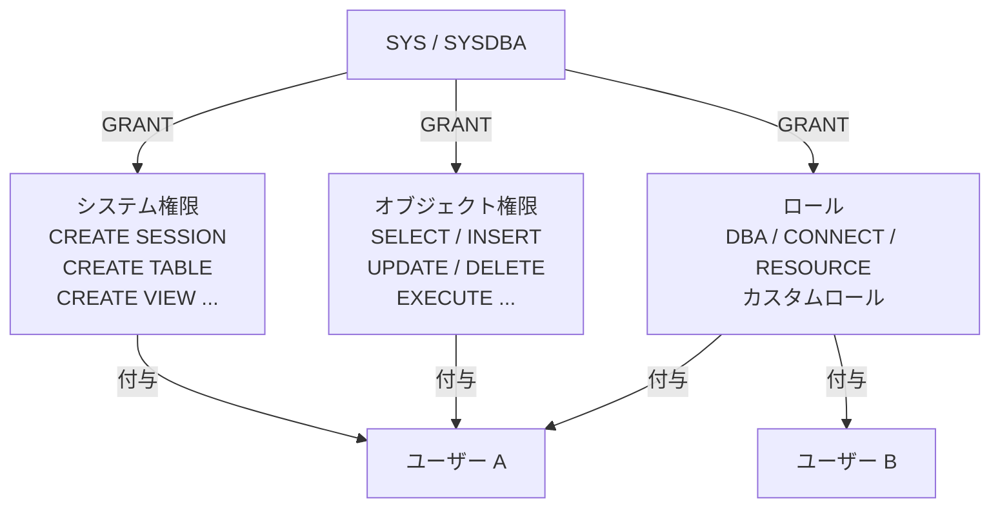
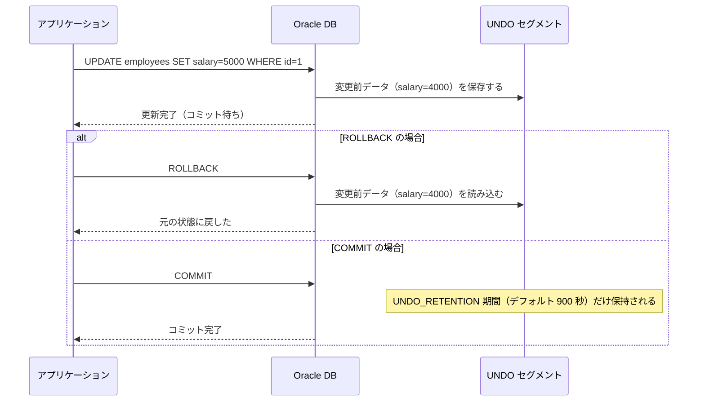

# Module 3: 守りとセキュリティ

「誰が何にアクセスできるか」と「変更をなかったことにできるか」は DB 管理の2大テーマです。
このモジュールでは、第5章でユーザー・権限・ロールを学び、第8章でトランザクションの整合性を支える UNDO を学びます。
Java 開発時に遭遇する ORA-01555「スナップショットが古すぎます」エラーの仕組みも、UNDO を理解すれば解消できます。

## 学習目標

- `CREATE USER` でユーザーを作成し、デフォルト表領域を設定できる
- システム権限とオブジェクト権限の違いを説明できる
- `GRANT` / `REVOKE` で権限を付与・剥奪できる
- ロールを使って権限をまとめて管理できる
- プロファイルでパスワードポリシーとリソース制限を設定できる
- UNDO の役割（ロールバック・読み取り一貫性）を説明できる
- `v$undostat` と `dba_undo_extents` で UNDO 表領域を監視できる

## 第5章: ユーザー管理と権限

### ユーザーの作成

Oracle にアクセスするにはユーザーアカウントが必要です。
`CREATE USER` で作成し、接続権限（`CREATE SESSION`）を付与するまでログインできません。

Oracle 21c XE はマルチテナント構成（CDB/PDB）であり、ローカルユーザーは PDB（XEPDB1）で管理します。
`sqlplus / as sysdba` で接続すると CDB ルートに入るため、まず PDB に切り替えてからユーザーを作成します。

```sql
-- PDB（XEPDB1）に切り替える
ALTER SESSION SET CONTAINER = XEPDB1;

CREATE USER app_user IDENTIFIED BY AppUser#1
  DEFAULT TABLESPACE users
  TEMPORARY TABLESPACE temp
  QUOTA 100M ON users;
```

| 句 | 役割 |
| :--- | :--- |
| `IDENTIFIED BY` | パスワードを設定する |
| `DEFAULT TABLESPACE` | テーブルなどを作成するデフォルトの表領域 |
| `TEMPORARY TABLESPACE` | ソートや結合で使う一時領域 |
| `QUOTA ... ON` | 表領域ごとに使用できる容量の上限 |

> **なぜデフォルト表領域を明示するか**
>
> 省略すると `SYSTEM` 表領域が使われます。`SYSTEM` は Oracle の内部管理用であり、
> ユーザーのオブジェクトを混在させると管理が複雑になります。必ず `USERS` など専用の表領域を指定してください。

### 権限とロール

Oracle の権限は2種類あり、さらにロールでまとめて管理できます。



| 種類 | 対象 | 例 |
| :--- | :--- | :--- |
| **システム権限** | Oracle 全体の操作 | `CREATE SESSION`（ログイン）、`CREATE TABLE`、`DROP ANY TABLE` |
| **オブジェクト権限** | 特定のテーブル・ビューなど | `SELECT ON employees`、`INSERT ON orders` |
| **ロール** | 権限のセット | `DBA`、`RESOURCE`、カスタムロール |

> **ロールを使う理由**
>
> 10人のユーザーに同じ10個の権限を付与する場合、直接付与すると100回の `GRANT` が必要です。
> ロールにまとめれば「ロールを1つ付与するだけ」で済みます。
> 権限の変更もロールを修正するだけで全ユーザーに反映されます。

`WITH GRANT OPTION` と `WITH ADMIN OPTION` は付与した権限を他者に委任できるオプションです。
オブジェクト権限には `WITH GRANT OPTION`、システム権限には `WITH ADMIN OPTION` を使います。

### プロファイルによる制限

プロファイルはユーザーに対するパスワードポリシーとリソース制限を定義するオブジェクトです。

| パラメータ | 説明 |
| :--- | :--- |
| `FAILED_LOGIN_ATTEMPTS` | ログイン失敗の上限回数（超えるとアカウントがロック） |
| `PASSWORD_LIFE_TIME` | パスワードの有効日数 |
| `SESSIONS_PER_USER` | 同時セッション数の上限 |
| `CPU_PER_CALL` | 1 コールで使える CPU 時間の上限（単位: 1/100 秒） |

すべてのユーザーはプロファイルを1つ持ちます。未指定の場合は `DEFAULT` プロファイルが適用されます。

## 第8章: UNDO 管理

### UNDO とは

DML（INSERT/UPDATE/DELETE）を実行すると、Oracle は変更前のデータを **UNDO セグメント** に自動保存します。
この仕組みが、ロールバックと読み取り一貫性を支えています。



UNDO には3つの用途があります。

| 用途 | 説明 |
| :--- | :--- |
| **ロールバック** | トランザクションを取り消し、変更前の状態に戻す |
| **読み取り一貫性** | SELECT 中に他のトランザクションが変更しても、SELECT 開始時点のデータを読む |
| **フラッシュバック** | `AS OF TIMESTAMP` で過去の状態を参照する |

### ORA-01555「スナップショットが古すぎます」

Java のバッチ処理やレポートで、長時間の SELECT を実行しているとき、このエラーに遭遇することがあります。

**発生の仕組み:**

1. SELECT が開始された時点の UNDO データを必要とする
2. その間に UNDO_RETENTION を超えて古い UNDO が上書きされる
3. 必要な UNDO データがなくなり ORA-01555 が発生する

**対策:**

- `UNDO_RETENTION` を増やす（デフォルト 900 秒）
- UNDO 表領域のサイズを拡張する
- 長時間 SELECT を分割・ページングする

### UNDO 表領域の監視ビュー

| ビュー | 確認できること |
| :--- | :--- |
| `v$undostat` | 10分間隔の UNDO 使用量・ORA-01555 発生回数・チューニング値 |
| `dba_undo_extents` | セグメントの状態（ACTIVE / UNEXPIRED / EXPIRED） |
| `v$parameter` | `undo_management`・`undo_retention`・`undo_tablespace` の現在値 |

`dba_undo_extents` に表示される状態の意味は以下のとおりです。

| 状態 | 説明 |
| :--- | :--- |
| `ACTIVE` | 現在のトランザクションが使用中 |
| `UNEXPIRED` | コミット済みだが UNDO_RETENTION 期間内のため保持中 |
| `EXPIRED` | UNDO_RETENTION を超えて再利用可能な状態 |

## ハンズオン

### Step 1: 現在のユーザーと権限を確認する

`SYSDBA` として接続し、PDB（XEPDB1）に切り替えてからユーザー一覧を確認します。

```bash
sqlplus / as sysdba
```

```sql
-- PDB（XEPDB1）に切り替える
ALTER SESSION SET CONTAINER = XEPDB1;

-- 最近作成されたユーザー一覧
SELECT username, account_status, default_tablespace, profile
FROM dba_users
ORDER BY created DESC
FETCH FIRST 10 ROWS ONLY;

-- SYSTEM ユーザーが持つシステム権限
SELECT privilege FROM dba_sys_privs WHERE grantee = 'SYSTEM';
```

---

### Step 2: 学習用ユーザーを作成する

2種類のユーザーを作成します。`app_user` はデータを作成・更新できるアプリケーションユーザー、
`readonly_user` は参照専用ユーザーです。PDB に切り替えた状態で実行してください。

```sql
CREATE USER app_user IDENTIFIED BY AppUser#1
  DEFAULT TABLESPACE users
  TEMPORARY TABLESPACE temp
  QUOTA 100M ON users;

CREATE USER readonly_user IDENTIFIED BY ReadOnly#1
  DEFAULT TABLESPACE users
  TEMPORARY TABLESPACE temp
  QUOTA 0 ON users;
```

作成を確認します。

```sql
SELECT username, account_status, default_tablespace
FROM dba_users
WHERE username IN ('APP_USER', 'READONLY_USER');
```

---

### Step 3: システム権限とロールを付与する

`CREATE SESSION` がないとログイン自体できません。まずこれを付与します。

```sql
-- ログイン権限
GRANT CREATE SESSION TO app_user;
GRANT CREATE SESSION TO readonly_user;

-- RESOURCE ロール（CREATE TABLE / CREATE SEQUENCE など）
GRANT RESOURCE TO app_user;
```

付与された権限を確認します。

```sql
SELECT grantee, privilege FROM dba_sys_privs WHERE grantee = 'APP_USER';
SELECT grantee, granted_role FROM dba_role_privs WHERE grantee = 'APP_USER';
```

---

### Step 4: オブジェクト権限のテストをする

`app_user` でサンプルテーブルを作成し、`readonly_user` がアクセスできないことを確認します。

```bash
sqlplus app_user/AppUser#1@localhost:1521/xepdb1
```

```sql
CREATE TABLE employees (
  id     NUMBER PRIMARY KEY,
  name   VARCHAR2(50),
  salary NUMBER
);
INSERT INTO employees VALUES (1, 'Alice', 5000);
INSERT INTO employees VALUES (2, 'Bob',   4200);
COMMIT;
EXIT;
```

`readonly_user` で試みると、権限エラー（ORA-00942）になります。

```bash
sqlplus readonly_user/ReadOnly#1@localhost:1521/xepdb1
```

```sql
-- ORA-00942: 表またはビューが存在しません
SELECT * FROM app_user.employees;
EXIT;
```

---

### Step 5: カスタムロールを作成してオブジェクト権限を付与する

`SYSDBA` に戻り、PDB に切り替えてからカスタムロールを作成して `readonly_user` に割り当てます。

```bash
sqlplus / as sysdba
```

```sql
ALTER SESSION SET CONTAINER = XEPDB1;

-- カスタムロールを作成する
CREATE ROLE app_readonly;

-- ロールにオブジェクト権限を付与する
GRANT SELECT ON app_user.employees TO app_readonly;

-- readonly_user にロールを付与する
GRANT app_readonly TO readonly_user;
```

今度は `readonly_user` からアクセスできます。

```bash
sqlplus readonly_user/ReadOnly#1@localhost:1521/xepdb1
```

```sql
-- 今度は成功する
SELECT * FROM app_user.employees;
EXIT;
```

---

### Step 6: プロファイルでパスワードポリシーを設定する

本番環境では、ログイン失敗回数やパスワード有効期限をプロファイルで管理します。

```bash
sqlplus / as sysdba
```

```sql
ALTER SESSION SET CONTAINER = XEPDB1;

CREATE PROFILE app_profile LIMIT
  FAILED_LOGIN_ATTEMPTS 5
  PASSWORD_LIFE_TIME    90
  SESSIONS_PER_USER     3;

-- ユーザーにプロファイルを適用する
ALTER USER app_user PROFILE app_profile;
```

設定を確認します。

```sql
SELECT username, profile FROM dba_users WHERE username = 'APP_USER';
SELECT profile, resource_name, limit
FROM dba_profiles
WHERE profile = 'APP_PROFILE'
ORDER BY resource_name;
```

---

### Step 7: UNDO 表領域の状態を確認する

引き続き `SYSDBA`（XEPDB1 コンテナ）のまま実行します。

```sql
-- UNDO 関連パラメータを確認する
SELECT name, value FROM v$parameter
WHERE name IN ('undo_management', 'undo_retention', 'undo_tablespace');

-- UNDO セグメントの状態（ACTIVE / UNEXPIRED / EXPIRED の内訳）
SELECT status, COUNT(*) extents, ROUND(SUM(bytes)/1024/1024, 1) mb
FROM dba_undo_extents
GROUP BY status;
```

`UNEXPIRED` は「コミット済みだが UNDO_RETENTION 内のため保持中」の状態です。
ORA-01555 を防ぐには、`UNEXPIRED` の領域が十分に確保されていることが重要です。

---

### Step 8: UNDO の統計を確認する

`v$undostat` で過去10分間隔の UNDO 使用状況を確認します。
`ssolderrcnt` が 0 より大きい場合、ORA-01555 が発生しています。

```sql
SELECT
  TO_CHAR(begin_time, 'HH24:MI') begin_time,
  TO_CHAR(end_time,   'HH24:MI') end_time,
  txncount,
  maxconcurrency,
  ssolderrcnt,
  tuned_undoretention
FROM v$undostat
ORDER BY begin_time DESC
FETCH FIRST 5 ROWS ONLY;
```

---

### Step 9: テスト後のクリーンアップをする

引き続き `SYSDBA`（XEPDB1 コンテナ）のまま実行します。

```sql
-- 学習用リソースをすべて削除する
DROP ROLE app_readonly;
DROP USER readonly_user CASCADE;
DROP USER app_user CASCADE;
DROP PROFILE app_profile;
```

`CASCADE` を指定すると、ユーザーが所有するすべてのオブジェクト（テーブルなど）も一緒に削除されます。

---

## 確認してみよう

1. `CREATE SESSION` とはどのような権限ですか？作成したばかりのユーザーへ最初に付与する必要がある理由を説明してください。
2. システム権限とオブジェクト権限の違いは何ですか？具体的な例を挙げて説明してください。
3. ロールを使う利点は何ですか？権限を直接ユーザーに付与する場合と比較してください。
4. UNDO データはどのような役割を担っていますか？`ROLLBACK` と「読み取り一貫性」それぞれの観点から説明してください。
5. ORA-01555「スナップショットが古すぎます」はなぜ発生しますか？また、どのような対策が考えられますか？

---

| [← Module 2: インスタンスと接続の制御](../module-02-instance/README.md) | [全章目次](../README.md) | [Module 4: データの器（ストレージ）管理 →](../module-04-storage/README.md) |
|:---|:---:|---:|
