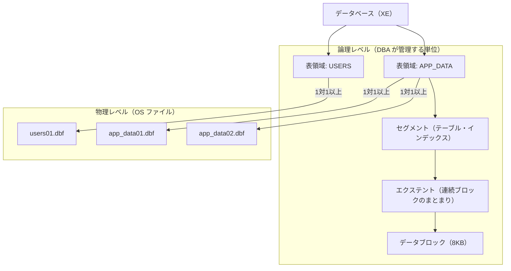
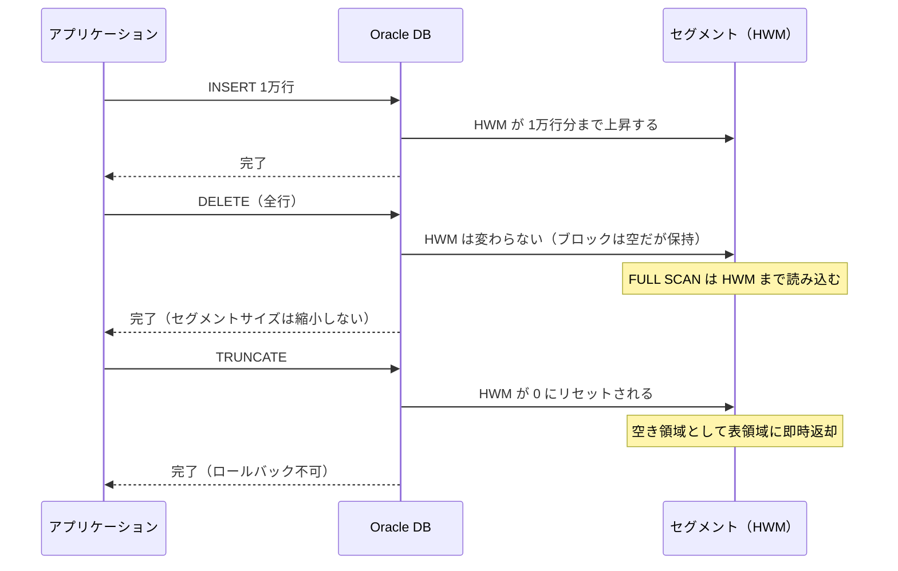

# Module 4: データの器（ストレージ）管理

Oracle のストレージは「論理（表領域）」と「物理（データファイル）」が分離して管理されます。
第6章で表領域・データファイルの作成と管理を学び、第7章でセグメント・エクステント・ブロックの階層構造を理解します。
「テーブルが肥大化したときに何が起きるか」「TRUNCATE と DELETE でスペース回収がなぜ違うのか」が、この章を読めば説明できるようになります。

## 学習目標

- Oracle のストレージ論理構造（表領域→セグメント→エクステント→ブロック）を説明できる
- `CREATE TABLESPACE` で表領域を作成し、データファイルを指定できる
- `ALTER TABLESPACE ADD DATAFILE` でデータファイルを追加・リサイズできる
- OMF（Oracle Managed Files）の仕組みと使い方を説明できる
- `dba_tablespaces`・`dba_data_files`・`dba_free_space` で容量を監視できる
- セグメント・エクステント・データブロックの役割を説明できる
- HWM（High Water Mark）の概念と TRUNCATE/DELETE の違いを説明できる

## 第6章: 表領域とデータファイル

### Oracle ストレージの2層構造

Oracle のストレージは「論理」と「物理」の2層に分かれています。
DBA が直接操作するのは論理単位（表領域）ですが、その背後には必ず物理ファイル（データファイル）が存在します。



> **なぜ論理と物理を分けるのか**
>
> 表領域は「ディスク容量を論理的にグループ化した器」です。
> この分離により、DBA はデータファイルを追加するだけで「器」を拡張できます。
> アプリケーション側はファイルの場所を意識せず、表領域名だけを指定すれば済みます。

### Oracle のデフォルト表領域

Oracle をインストールすると、以下の表領域が自動的に作成されます。
これらは Oracle が内部で使用するため、ユーザーのオブジェクトは別の表領域（`USERS` など）に作成します。

| 表領域 | 種類 | 用途 |
| :--- | :--- | :--- |
| `SYSTEM` | PERMANENT | Oracle 内部データディクショナリ用（絶対に触らない） |
| `SYSAUX` | PERMANENT | AWR・Enterprise Manager 補助データ |
| `USERS` | PERMANENT | 一般ユーザーのデフォルト作業領域 |
| `TEMP` | TEMPORARY | ソート・ハッシュ結合などの一時作業用 |
| `UNDOTBS1` | UNDO | UNDO データ（Module 3 で学習済み） |

> **SYSTEM 表領域を使ってはいけない理由**
>
> Oracle の内部管理データ（データディクショナリ）が格納されており、
> ユーザーのオブジェクトを混在させると管理が困難になります。
> `CREATE USER` で `DEFAULT TABLESPACE` を明示指定するのはこのためです（Module 3 参照）。

### 表領域の作成

```sql
CREATE TABLESPACE app_data
  DATAFILE '/opt/oracle/oradata/XE/XEPDB1/app_data01.dbf' SIZE 10M
  AUTOEXTEND ON NEXT 5M MAXSIZE 100M
  EXTENT MANAGEMENT LOCAL AUTOALLOCATE
  SEGMENT SPACE MANAGEMENT AUTO;
```

| 句 | 役割 |
| :--- | :--- |
| `DATAFILE` | 物理ファイルのパスと初期サイズを指定する |
| `AUTOEXTEND ON NEXT` | 空き容量不足時に自動拡張する（NEXT: 1回の拡張量） |
| `MAXSIZE` | 自動拡張の上限（省略すると OS の空き容量いっぱいまで拡張） |
| `EXTENT MANAGEMENT LOCAL` | エクステント管理をビットマップで行う（現在の推奨方式） |
| `SEGMENT SPACE MANAGEMENT AUTO` | セグメント内の空き領域を自動管理する（現在の推奨方式） |

> **AUTOEXTEND の注意点**
>
> `MAXSIZE` を省略すると、ディスクが満杯になるまで自動拡張します。
> 本番環境では必ず `MAXSIZE` を設定し、`dba_free_space` で定期的に空き容量を監視してください。

### OMF（Oracle Managed Files）

`DB_CREATE_FILE_DEST` パラメータを設定すると、データファイルのパスと名前を Oracle が自動生成します。
DBA がファイル名の命名規則を管理する手間がなくなります。

```sql
-- CDB ルートで OMF を有効にする
ALTER SYSTEM SET DB_CREATE_FILE_DEST='/opt/oracle/oradata/XE' SCOPE=BOTH;

-- PDB に切り替えてから DATAFILE 句を省略して表領域を作成する
ALTER SESSION SET CONTAINER = XEPDB1;
CREATE TABLESPACE app_omf;  -- ファイル名は Oracle が自動生成する
```

OMF が有効な場合、データファイル名は `o1_mf_<tablespace>_<random>.dbf` のような形式で自動生成されます。
`DROP TABLESPACE ... INCLUDING CONTENTS AND DATAFILES` を実行すると、ファイルも自動で削除されます。

### 表領域・データファイルの監視ビュー

| ビュー | 確認できること |
| :--- | :--- |
| `dba_tablespaces` | 表領域の属性（種類・状態・エクステント管理方式） |
| `dba_data_files` | データファイルのパス・サイズ・AUTOEXTEND 設定 |
| `dba_free_space` | 表領域内の空き領域（フラグメント単位） |
| `dba_temp_files` | 一時表領域（TEMP）のファイル情報 |

## 第7章: セグメント・エクステント・ブロック

### 論理ストレージ階層

Oracle のストレージは4層の階層構造を持っています。
データが増えると、Oracle は自動的に下位の単位を追加して領域を拡張します。

| 単位 | 説明 | イメージ |
| :--- | :--- | :--- |
| 表領域（Tablespace） | 論理ストレージの最上位単位 | フォルダ |
| セグメント（Segment） | テーブル・インデックス等1つ分の論理オブジェクト | ファイル |
| エクステント（Extent） | セグメントを構成する連続ブロックのまとまり | ファイルの断片 |
| データブロック（Block） | Oracle I/O の最小単位（デフォルト 8KB） | クラスター |

データが増えると Oracle はエクステントを追加してセグメントを拡張します。
`UNLIMITED` 以外の `MAXEXTENTS` を設定している場合は `ORA-01631`（最大エクステント数超過）が発生します。

### セグメントの種類

| 種類 | 説明 |
| :--- | :--- |
| データセグメント | テーブル・マテリアライズドビューのデータ |
| インデックスセグメント | インデックスのデータ |
| 一時セグメント | ソート・ハッシュ結合の作業領域（自動生成・削除） |
| UNDO セグメント | ロールバックデータ（Module 3 で学習済み） |
| LOB セグメント | CLOB/BLOB 列（テーブル本体と別セグメントに格納） |

### HWM（High Water Mark）と TRUNCATE vs DELETE

HWM はセグメントの「使ったことがある最大ブロック位置」を示すポインタです。
Oracle の FULL SCAN は HWM まで読み込むため、HWM が高いと DELETE 後でもパフォーマンスが低下します。



| 操作 | HWM | 領域の返却 | ROLLBACK |
| :--- | :--- | :--- | :--- |
| `DELETE` | 変わらない | 返却しない（セグメントが保持） | 可能 |
| `TRUNCATE` | 0 にリセット | 空き領域として即時返却 | 不可 |

> **Java 開発者が知っておくべきポイント**
>
> テーブルをほぼ空にした後も FULL SCAN が遅い場合は HWM が高いままの可能性があります。
> 定期的に全データを削除して作り直す用途（ステージングテーブルなど）では `TRUNCATE` を使ってください。
> `TRUNCATE` はロールバックできないため、誤削除に注意が必要です。

### データブロックの構造

Oracle の I/O 最小単位はデータブロック（デフォルト 8KB）です。
OS のブロックサイズ（通常 4KB）より大きく、1回の I/O でより多くのデータを読み込めます。

| 領域 | 内容 |
| :--- | :--- |
| ブロックヘッダー | ブロック番号・行ディレクトリ・トランザクション情報 |
| フリースペース | INSERT/UPDATE の余白（`PCTFREE` で制御） |
| 行データ | 実際のデータ（可変長） |

`PCTFREE = 10`（デフォルト）はブロックの10%を UPDATE 用の予備として確保することを意味します。
UPDATE でデータが増える（VARCHAR2 列の更新など）場合は、この余白がないと行移行（Row Migration）が発生してパフォーマンスが低下します。

### セグメント・エクステントの監視ビュー

| ビュー | 確認できること |
| :--- | :--- |
| `dba_segments` | セグメント一覧・使用ブロック数・バイト数 |
| `dba_extents` | エクステントごとのブロック範囲 |
| `user_tables` | テーブルの統計情報（NUM_ROWS, BLOCKS, AVG_ROW_LEN） |

## ハンズオン

### Step 1: 現在の表領域と空き容量を確認する

`SYSDBA` として接続し、PDB（XEPDB1）に切り替えてから表領域の状態を確認します。

```bash
sqlplus / as sysdba
```

```sql
-- PDB（XEPDB1）に切り替える
ALTER SESSION SET CONTAINER = XEPDB1;

-- 表領域一覧と属性を確認する
SELECT tablespace_name, status, contents, extent_management, segment_space_management
FROM dba_tablespaces
ORDER BY tablespace_name;

-- データファイルの場所とサイズを確認する
SELECT file_name, tablespace_name,
       ROUND(bytes/1024/1024, 0) mb, autoextensible
FROM dba_data_files
ORDER BY tablespace_name;
```

---

### Step 2: 新しい表領域を作成する

DATAFILE を明示指定して表領域を作成します。
PDB（XEPDB1）のデータファイルは `/opt/oracle/oradata/XE/XEPDB1/` に格納します。

```sql
CREATE TABLESPACE app_data
  DATAFILE '/opt/oracle/oradata/XE/XEPDB1/app_data01.dbf' SIZE 10M
  AUTOEXTEND ON NEXT 5M MAXSIZE 100M
  EXTENT MANAGEMENT LOCAL AUTOALLOCATE
  SEGMENT SPACE MANAGEMENT AUTO;
```

作成を確認します。

```sql
SELECT tablespace_name, status, contents, bigfile
FROM dba_tablespaces
WHERE tablespace_name = 'APP_DATA';

SELECT file_name, ROUND(bytes/1024/1024, 0) mb, autoextensible, maxbytes/1024/1024 maxmb
FROM dba_data_files
WHERE tablespace_name = 'APP_DATA';
```

---

### Step 3: データファイルを追加・リサイズする

表領域にデータファイルをもう1つ追加し、既存ファイルをリサイズします。

```sql
-- データファイルを追加する
ALTER TABLESPACE app_data
  ADD DATAFILE '/opt/oracle/oradata/XE/XEPDB1/app_data02.dbf' SIZE 10M;

-- 既存のデータファイルをリサイズする
ALTER DATABASE DATAFILE '/opt/oracle/oradata/XE/XEPDB1/app_data01.dbf'
  RESIZE 20M;

-- 変更後の状態を確認する
SELECT file_name, ROUND(bytes/1024/1024, 0) mb
FROM dba_data_files
WHERE tablespace_name = 'APP_DATA';
```

---

### Step 4: OMF で表領域を作成する

OMF（Oracle Managed Files）を有効にするには、まず CDB ルートでパラメータを設定します。
`DB_CREATE_FILE_DEST` は PDB スコープ外のため、`sqlplus / as sysdba` の接続（CDB ルート）で設定します。

```bash
sqlplus / as sysdba
```

```sql
-- CDB ルートで OMF のベースディレクトリを設定する
ALTER SYSTEM SET DB_CREATE_FILE_DEST='/opt/oracle/oradata/XE' SCOPE=BOTH;

-- PDB（XEPDB1）に切り替える
ALTER SESSION SET CONTAINER = XEPDB1;

-- DATAFILE 句を省略して表領域を作成する（ファイル名は Oracle が自動生成する）
CREATE TABLESPACE app_omf;

-- 生成されたファイル名と場所を確認する
SELECT file_name, ROUND(bytes/1024/1024, 0) mb
FROM dba_data_files
WHERE tablespace_name = 'APP_OMF';
```

---

### Step 5: 表領域の空き容量を確認する

引き続き `SYSDBA`（XEPDB1 コンテナ）のまま実行します。

```sql
SELECT
  t.tablespace_name,
  ROUND(SUM(d.bytes)/1024/1024, 1)           total_mb,
  ROUND(SUM(NVL(f.free_bytes,0))/1024/1024, 1) free_mb,
  ROUND((1 - SUM(NVL(f.free_bytes,0))
              / SUM(d.bytes)) * 100, 1)       used_pct
FROM dba_tablespaces t
JOIN dba_data_files d ON t.tablespace_name = d.tablespace_name
LEFT JOIN (
  SELECT tablespace_name, SUM(bytes) free_bytes
  FROM   dba_free_space
  GROUP  BY tablespace_name
) f ON t.tablespace_name = f.tablespace_name
WHERE t.contents = 'PERMANENT'
GROUP BY t.tablespace_name
ORDER BY t.tablespace_name;
```

`used_pct` が 80% を超えている場合は、データファイルの追加または AUTOEXTEND の上限引き上げを検討してください。

---

### Step 6: セグメントとエクステントを確認する

`app_data` 表領域にテスト用テーブルを作成し、セグメントが成長する様子を観察します。

```sql
-- テスト用テーブルを app_data 表領域に作成する
CREATE TABLE storage_test (
  id     NUMBER,
  data   VARCHAR2(100)
) TABLESPACE app_data;

-- 1000 行挿入してセグメントを成長させる
BEGIN
  FOR i IN 1..1000 LOOP
    INSERT INTO storage_test VALUES (i, LPAD('X', 100, 'X'));
  END LOOP;
  COMMIT;
END;
/

-- セグメントの使用状況を確認する（エクステント数・ブロック数・バイト数）
SELECT segment_name, segment_type, extents, blocks,
       ROUND(bytes/1024, 0) kb
FROM dba_segments
WHERE owner = 'SYS' AND segment_name = 'STORAGE_TEST';

-- エクステントの内訳を確認する
SELECT extent_id, block_id, blocks
FROM dba_extents
WHERE owner = 'SYS' AND segment_name = 'STORAGE_TEST'
ORDER BY extent_id;
```

---

### Step 7: HWM（High Water Mark）の動作を確認する

DELETE と TRUNCATE で HWM の挙動の違いを確認します。

```sql
-- DELETE: HWM は変わらない（ブロックは空だがセグメントが保持したまま）
DELETE FROM storage_test;
COMMIT;

SELECT extents, blocks, ROUND(bytes/1024, 0) kb
FROM dba_segments
WHERE owner = 'SYS' AND segment_name = 'STORAGE_TEST';
-- → DELETE 前と同じ値が表示される（HWM は変わっていない）

-- 再び 1000 行挿入する
BEGIN
  FOR i IN 1..1000 LOOP
    INSERT INTO storage_test VALUES (i, LPAD('X', 100, 'X'));
  END LOOP;
  COMMIT;
END;
/

-- TRUNCATE: HWM が 0 にリセットされ、領域が表領域に返却される
TRUNCATE TABLE storage_test;

SELECT extents, blocks, ROUND(bytes/1024, 0) kb
FROM dba_segments
WHERE owner = 'SYS' AND segment_name = 'STORAGE_TEST';
-- → blocks が大幅に減少する（HWM がリセットされた）
```

---

### Step 8: データブロックのパラメータを確認する

```sql
-- ブロックサイズとマルチブロック読み込み数を確認する
SELECT name, value FROM v$parameter
WHERE name IN ('db_block_size', 'db_file_multiblock_read_count');

-- テーブルの統計情報（DBMS_STATS.GATHER_TABLE_STATS 後に値が入る）
EXEC DBMS_STATS.GATHER_TABLE_STATS('SYS', 'STORAGE_TEST');

SELECT table_name, num_rows, blocks, avg_row_len
FROM dba_tables
WHERE owner = 'SYS' AND table_name = 'STORAGE_TEST';
```

`db_block_size = 8192`（8KB）、`db_file_multiblock_read_count = 128` の場合、
FULL SCAN では 128 × 8KB = 1MB を 1回の I/O でまとめて読み込みます。

---

### Step 9: テスト後のクリーンアップをする

引き続き `SYSDBA`（XEPDB1 コンテナ）のまま実行します。

```sql
-- テスト用テーブルを削除する（PURGE でごみ箱を経由せずに完全削除）
DROP TABLE storage_test PURGE;

-- 表領域を削除する（INCLUDING CONTENTS AND DATAFILES で OS ファイルも削除）
DROP TABLESPACE app_omf INCLUDING CONTENTS AND DATAFILES;
DROP TABLESPACE app_data INCLUDING CONTENTS AND DATAFILES;

-- OMF 設定を元に戻す（CDB ルートで実行）
ALTER SESSION SET CONTAINER = CDB$ROOT;
ALTER SYSTEM SET DB_CREATE_FILE_DEST='' SCOPE=BOTH;
```

`INCLUDING CONTENTS AND DATAFILES` を指定することで、表領域内のオブジェクトと物理ファイルが一緒に削除されます。

---

## 確認してみよう

1. Oracle のストレージは「表領域」と「データファイル」の2つに分かれて管理されます。この2つの関係を説明してください。
2. `CREATE TABLESPACE` で `AUTOEXTEND ON` を指定すると何が起きますか？指定しない場合と比較して説明してください。
3. OMF（Oracle Managed Files）を使う利点は何ですか？通常のファイル指定と比べて説明してください。
4. セグメント・エクステント・データブロックは、それぞれどのような役割を持ちますか？階層構造を意識して説明してください。
5. `DELETE` と `TRUNCATE` では、テーブルのストレージ（HWM）はどう違いますか？FULL SCAN のパフォーマンスへの影響も含めて説明してください。

---

| [← Module 3: 守りとセキュリティ](../module-03-security/README.md) | [全章目次](../README.md) | [Module 5: データの搬入・搬出 →](../module-05-datapump/README.md) |
|:---|:---:|---:|
