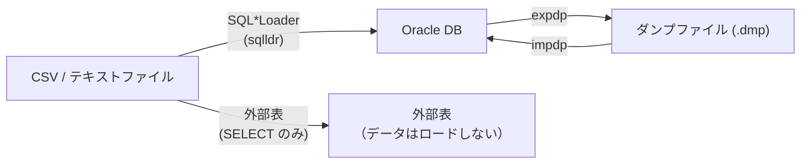
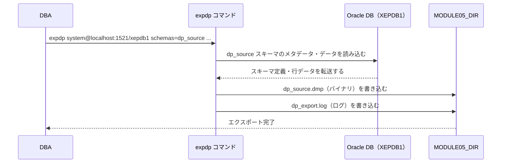

# Module 5: データの搬入・搬出

「データを Oracle に入れる・出す」作業は、開発・運用を問わず必ず発生します。
第9章では Data Pump（`expdp`/`impdp`）でスキーマをまるごと移行する方法と、
SQL\*Loader で CSV を高速にロードする方法、そして外部表でファイルをそのままテーブルとして扱う方法を学びます。

## 学習目標

- Data Pump と SQL\*Loader の用途の違いを説明できる
- `expdp` でスキーマをダンプファイルにエクスポートできる
- `impdp` でダンプファイルを別スキーマにインポートできる（`REMAP_SCHEMA`）
- `DIRECTORY` オブジェクトの役割を説明し、作成できる
- SQL\*Loader のコントロールファイル（`.ctl`）の基本構造を記述できる
- `sqlldr` コマンドで CSV データをテーブルにロードできる
- 外部表を作成し、CSV ファイルを `SELECT` で参照できる

## ツールの使い分け

Oracle にはデータを移行・ロードする方法が3種類あります。
目的に合わせて使い分けることが重要です。



| ツール | 主な用途 | データ形式 |
| :--- | :--- | :--- |
| Data Pump (`expdp`/`impdp`) | スキーマ・テーブルの移行・論理バックアップ | Oracle 独自バイナリ形式（.dmp） |
| SQL\*Loader (`sqlldr`) | CSV などのフラットファイルを一括ロード | CSV・固定長テキスト |
| 外部表 | ファイルをテーブルとして `SELECT` で参照（ロードせず使える） | CSV・固定長テキスト |

## 第9章: Data Pump

### DIRECTORY オブジェクト

Oracle はセキュリティ上の理由から、ファイルシステムへの直接アクセスを禁止しています。
`CREATE DIRECTORY` でディレクトリオブジェクトを登録し、それ経由でファイルにアクセスします。
`expdp`・`impdp`・外部表のすべてがこの仕組みを使います。

```sql
-- PDB（XEPDB1）内でディレクトリオブジェクトを作成する
ALTER SESSION SET CONTAINER = XEPDB1;

CREATE OR REPLACE DIRECTORY module05_dir
  AS '/workspaces/starter-oracle-db/module-05-datapump';

-- 使用するユーザーに権限を付与する
GRANT READ, WRITE ON DIRECTORY module05_dir TO system;
```

| 権限 | 説明 |
| :--- | :--- |
| `READ` | ファイルの読み込み（impdp・外部表の参照） |
| `WRITE` | ファイルの書き込み（expdp・ログファイル出力） |

> **DIRECTORY は PDB コンテキストで作成する**
>
> Oracle 21c XE のマルチテナント構成では、`expdp`/`impdp` は PDB に接続して実行します。
> PDB から参照できるディレクトリオブジェクトは、PDB コンテキスト（`ALTER SESSION SET CONTAINER = XEPDB1`）で作成する必要があります。
> `sqlplus / as sysdba`（CDB ルート）で作成したディレクトリは PDB からは参照できません。

### expdp でエクスポートする



```bash
expdp system@localhost:1521/xepdb1 \
  schemas=dp_source \
  dumpfile=dp_source.dmp \
  logfile=dp_export.log \
  directory=MODULE05_DIR
```

| オプション | 説明 |
| :--- | :--- |
| `schemas` | エクスポートするスキーマ名（複数指定可: `schema1,schema2`） |
| `dumpfile` | 出力するダンプファイル名 |
| `logfile` | ログファイル名（ターミナル出力と同じ内容） |
| `directory` | 使用するディレクトリオブジェクト名 |

### impdp でインポートする

```bash
impdp system@localhost:1521/xepdb1 \
  dumpfile=dp_source.dmp \
  logfile=dp_import.log \
  directory=MODULE05_DIR \
  remap_schema=dp_source:dp_target
```

`REMAP_SCHEMA=source:target` を指定すると、ダンプ内のオブジェクトを別のスキーマ名に変換してインポートできます。
本番環境のダンプを開発環境へ移行する場面でよく使います。

> **expdp/impdp のパスワード入力**
>
> `system@localhost:1521/xepdb1` とユーザー名だけ指定すると、実行時に `Password:` プロンプトが表示されます。
> スクリプトにパスワードを直接書かないようにしてください。

## SQL\*Loader

SQL\*Loader は CSV などのテキストファイルを Oracle テーブルへ高速にロードするツールです。
ロード後はデータが Oracle へ保存され、通常のテーブルとして操作できます。

### コントロールファイルの構造

SQL\*Loader の動作はコントロールファイル（`.ctl`）で定義します。

```text
OPTIONS (SKIP=1)                          -- ヘッダー行をスキップ
LOAD DATA
INFILE '/path/to/employees.csv'           -- 読み込む CSV ファイル
INTO TABLE emp_load TRUNCATE              -- ロード先テーブル（TRUNCATE: 既存データを削除）
FIELDS TERMINATED BY ','                  -- フィールド区切り文字
OPTIONALLY ENCLOSED BY '"'               -- 文字列の囲み文字
TRAILING NULLCOLS                         -- 末尾が空でも NULL として扱う
(
  id,
  name,
  department,
  salary
)
```

`TRUNCATE` の代わりに `APPEND`（追記）や `INSERT`（テーブルが空の場合のみ）も指定できます。

### sqlldr コマンド

```bash
sqlldr dp_target/DpTarget#1@localhost:1521/xepdb1 \
  control=/workspaces/starter-oracle-db/module-05-datapump/employees.ctl \
  log=/workspaces/starter-oracle-db/module-05-datapump/sqlldr.log \
  bad=/workspaces/starter-oracle-db/module-05-datapump/sqlldr.bad
```

| ファイル | 内容 |
| :--- | :--- |
| `.log` | ロードの統計情報（成功・失敗行数・実行時間） |
| `.bad` | ロードに失敗した行（型変換エラーなど） |
| `.discard` | `WHEN` 句の条件に一致せずスキップされた行 |

ロード後に `.bad` ファイルが空でなければ、その行を修正して再実行します。

## 外部表

外部表は CSV ファイルを Oracle テーブルとして「見せる」仕組みです。
SQL\*Loader と異なり、データを Oracle に取り込みません。
ファイルをそのまま参照できるため、ETL 処理のステージングや一時的なデータ確認に使います。

```sql
CREATE TABLE ext_employees (
  id         NUMBER,
  name       VARCHAR2(50),
  department VARCHAR2(30),
  salary     NUMBER
)
ORGANIZATION EXTERNAL (
  TYPE oracle_loader
  DEFAULT DIRECTORY module05_dir
  ACCESS PARAMETERS (
    RECORDS DELIMITED BY NEWLINE
    SKIP 1
    FIELDS TERMINATED BY ','
    OPTIONALLY ENCLOSED BY '"'
  )
  LOCATION ('employees.csv')
)
REJECT LIMIT UNLIMITED;
```

`ORGANIZATION EXTERNAL` が通常のテーブルとの違いです。
外部表は `SELECT` で参照できますが、`INSERT`/`UPDATE`/`DELETE` は実行できません。
ファイルを削除・移動すると `SELECT` がエラーになります。

## ハンズオン

### Step 1: ディレクトリオブジェクトを作成する

`SYSDBA` として接続し、PDB（XEPDB1）に切り替えてからディレクトリオブジェクトを登録します。

```bash
sqlplus / as sysdba
```

```sql
-- PDB（XEPDB1）に切り替える
ALTER SESSION SET CONTAINER = XEPDB1;

-- PDB コンテキストでディレクトリオブジェクトを作成する
CREATE OR REPLACE DIRECTORY module05_dir
  AS '/workspaces/starter-oracle-db/module-05-datapump';

-- SYSTEM ユーザーに READ / WRITE 権限を付与する
GRANT READ, WRITE ON DIRECTORY module05_dir TO system;

-- 確認
SELECT directory_name, directory_path FROM dba_directories
WHERE directory_name = 'MODULE05_DIR';
EXIT;
```

---

### Step 2: ソーススキーマとサンプルデータを準備する

`dp_source` ユーザーと `employees`・`departments` テーブルを一括作成します。

```bash
sqlplus / as sysdba @/workspaces/starter-oracle-db/module-05-datapump/setup-source.sql
```

スクリプトが完了すると、`dp_source` スキーマに2テーブル・計11行が作成されます。

---

### Step 3: expdp でスキーマをエクスポートする

`expdp` は `sqlplus` ではなくターミナルのシェルから直接実行します。
パスワードのプロンプトが表示されたら SYSTEM ユーザーのパスワードを入力してください。

```bash
expdp system@localhost:1521/xepdb1 \
  schemas=dp_source \
  dumpfile=dp_source.dmp \
  logfile=dp_export.log \
  directory=MODULE05_DIR
```

最後に `Export: Release ... successfully completed` と表示されれば成功です。
ダンプファイルが `module-05-datapump/dp_source.dmp` に作成されます。

---

### Step 4: インポート先ユーザーを作成する

ダンプの移行先となる `dp_target` ユーザーを作成します。

```bash
sqlplus / as sysdba
```

```sql
ALTER SESSION SET CONTAINER = XEPDB1;

BEGIN
  EXECUTE IMMEDIATE 'DROP USER dp_target CASCADE';
EXCEPTION
  WHEN OTHERS THEN NULL;
END;
/

CREATE USER dp_target IDENTIFIED BY DpTarget#1
  DEFAULT TABLESPACE users
  TEMPORARY TABLESPACE temp
  QUOTA UNLIMITED ON users;

GRANT CREATE SESSION, CREATE TABLE, CREATE SEQUENCE TO dp_target;
EXIT;
```

---

### Step 5: impdp でスキーマをインポートする

`REMAP_SCHEMA` で `dp_source` のオブジェクトを `dp_target` スキーマにインポートします。

```bash
impdp system@localhost:1521/xepdb1 \
  dumpfile=dp_source.dmp \
  logfile=dp_import.log \
  directory=MODULE05_DIR \
  remap_schema=dp_source:dp_target
```

`ORA-31684: Object type USER:"DP_TARGET" already exists` が表示される場合は正常です。
Step 4 で `dp_target` を事前に作成しているため、ユーザー作成のみスキップされてデータのインポートは続行されます。

インポート後に `dp_target` で確認します。

```bash
sqlplus dp_target/DpTarget#1@localhost:1521/xepdb1
```

```sql
SELECT table_name FROM user_tables ORDER BY table_name;
SELECT COUNT(*) FROM employees;
SELECT COUNT(*) FROM departments;
EXIT;
```

`employees`・`departments` テーブルと同じ行数が表示されれば成功です。

---

### Step 6: SQL\*Loader 用テーブルを作成する

CSV のロード先となる `emp_load` テーブルを `dp_target` スキーマに作成します。

```bash
sqlplus dp_target/DpTarget#1@localhost:1521/xepdb1
```

```sql
CREATE TABLE emp_load (
  id         NUMBER,
  name       VARCHAR2(50),
  department VARCHAR2(30),
  salary     NUMBER
);
EXIT;
```

---

### Step 7: sqlldr で CSV をロードする

コントロールファイルを指定して `sqlldr` を実行します。
`employees.csv`（8行）が `emp_load` テーブルにロードされます。

```bash
sqlldr dp_target/DpTarget#1@localhost:1521/xepdb1 \
  control=/workspaces/starter-oracle-db/module-05-datapump/employees.ctl \
  log=/workspaces/starter-oracle-db/module-05-datapump/sqlldr.log \
  bad=/workspaces/starter-oracle-db/module-05-datapump/sqlldr.bad
```

ログを確認してロード件数を確認します。

```bash
grep -E "Rows successfully loaded|Rows not loaded" \
  /workspaces/starter-oracle-db/module-05-datapump/sqlldr.log
```

---

### Step 8: 外部表で CSV を参照する

外部表を作成し、`employees.csv` を Oracle から直接 `SELECT` します。
データは Oracle には保存されません。

```bash
sqlplus / as sysdba @/workspaces/starter-oracle-db/module-05-datapump/external-table.sql
```

`SELECT` の結果として `employees.csv` の内容が表示されれば成功です。

---

### Step 9: テスト後のクリーンアップをする

```bash
sqlplus / as sysdba
```

```sql
ALTER SESSION SET CONTAINER = XEPDB1;

DROP USER dp_target CASCADE;
DROP USER dp_source CASCADE;

ALTER SESSION SET CONTAINER = CDB$ROOT;
DROP DIRECTORY module05_dir;
EXIT;
```

生成されたファイルをターミナルで削除します。

```bash
rm -f /workspaces/starter-oracle-db/module-05-datapump/dp_source.dmp \
      /workspaces/starter-oracle-db/module-05-datapump/dp_export.log \
      /workspaces/starter-oracle-db/module-05-datapump/dp_import.log \
      /workspaces/starter-oracle-db/module-05-datapump/sqlldr.log \
      /workspaces/starter-oracle-db/module-05-datapump/sqlldr.bad \
      /workspaces/starter-oracle-db/module-05-datapump/EXT_EMPLOYEES_*.log
```

> **外部表アクセス時のログファイルについて**
>
> 外部表を `SELECT` するたびに `EXT_EMPLOYEES_<pid>.log` が MODULE05_DIR に自動生成されます。
> これは Oracle が外部表アクセスエラーを記録するためのファイルで、正常動作の証拠です。

---

## 確認してみよう

1. Data Pump と SQL\*Loader はどのような用途に使い分けますか？外部表も含めて説明してください。
2. `DIRECTORY` オブジェクトが必要な理由は何ですか？任意のファイルパスを直接指定しない理由を説明してください。
3. `impdp` の `REMAP_SCHEMA` オプションはどのような場面で使いますか？具体的な例を挙げてください。
4. SQL\*Loader のコントロールファイルには何を記述しますか？`.bad` ファイルと `.log` ファイルの役割も説明してください。
5. 外部表と SQL\*Loader の違いは何ですか？外部表が適している場面はどのような場合ですか？

---

| [← Module 4: データの器（ストレージ）管理](../module-04-storage/README.md) | [全章目次](../README.md) | [Module 6: 開発者の一歩先を行くSQL →](../module-06-sql/README.md) |
|:---|:---:|---:|
