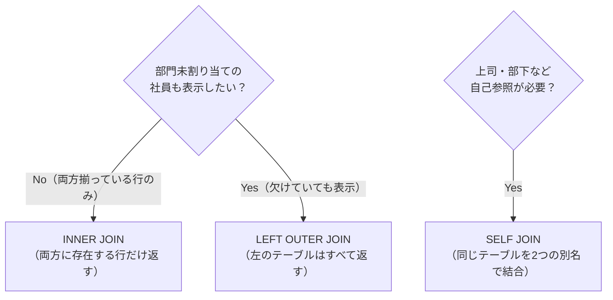
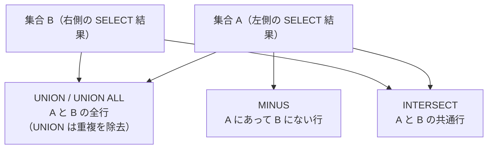

# Module 6: 開発者の一歩先を行くSQL

Java 開発者は SELECT 文の基礎をすでに知っています。
このモジュールでは Oracle 固有の関数・多彩な結合・副問合せ・集合演算・DML を学び、
「テーブルから必要なデータを思い通りに取り出す・更新する」スキルを実践で身につけます。

## 学習目標

- `NVL`・`DECODE`・`CASE` で NULL や条件分岐を扱える
- 文字・数値・日付・変換関数（`TO_CHAR`・`TO_DATE` など）を使える
- `GROUP BY` / `HAVING` で集計と絞り込みを組み合わせられる
- `INNER JOIN`・`LEFT OUTER JOIN`・`SELF JOIN` を使い分けられる
- 副問合せ（スカラー・インライン・相関）を書ける
- `UNION`・`INTERSECT`・`MINUS` で集合演算を実行できる
- `INSERT`・`UPDATE`・`DELETE`・`MERGE` でデータを操作できる
- `ROWNUM` と分析関数（`ROW_NUMBER() OVER`）の使い方を説明できる

## 第10章: SELECT の基礎と Oracle 固有の機能

### DUAL テーブル

Oracle には `DUAL` という1行1列のダミーテーブルがあります。
`SELECT SYSDATE FROM dual;` のように、関数の結果や計算式を手軽に確認するために使います。

```sql
-- 現在日時と30日後の日付を表示する
SELECT SYSDATE today, SYSDATE + 30 next_month FROM dual;

-- 計算式の確認
SELECT 100 * 1.08 tax_included FROM dual;
```

### ROWNUM

`ROWNUM` は Oracle 固有の擬似列で、結果の各行に連番を付与します。
ただし **`ORDER BY` より先に付与**されるため、ソート後に上位N件を取得するには副問合せが必要です。

```sql
-- NG: ORDER BY の前に ROWNUM が付くため、意図した結果にならない
SELECT emp_id, name, salary FROM employees
WHERE ROWNUM <= 3
ORDER BY salary DESC;

-- OK: 副問合せで先にソートしてから ROWNUM で絞る
SELECT emp_id, name, salary
FROM (
  SELECT emp_id, name, salary FROM employees ORDER BY salary DESC
)
WHERE ROWNUM <= 3;
```

## 第11章: 単一行関数

### NULL を扱う関数

NULL の扱いは Java の `null` と似ていますが、SQL では `= NULL` では比較できず `IS NULL` を使います。
Java の `Optional` に相当する NULL 対応関数が Oracle には豊富に用意されています。

| 関数 | 説明 | Java に例えると |
| :--- | :--- | :--- |
| `NVL(expr, default)` | NULL なら default を返す | `Optional.orElse(default)` |
| `NVL2(expr, nn_val, null_val)` | NULL かどうかで返す値を切り替える | 三項演算子 `expr != null ? nn_val : null_val` |
| `NULLIF(expr1, expr2)` | 2つの値が等しければ NULL を返す | — |
| `COALESCE(e1, e2, ...)` | 最初に NULL でない値を返す | 複数の `orElse` をチェーンしたもの |

### 条件分岐: DECODE と CASE

```sql
-- DECODE: Oracle 固有（Java の switch 文に相当）
SELECT name, DECODE(dept_id,
                10, 'Engineering',
                20, 'Marketing',
                30, 'HR',
                'その他') dept
FROM employees;

-- CASE: ANSI 標準（Java の if-else に相当）
SELECT name, salary,
  CASE WHEN salary >= 5000 THEN 'Senior'
       WHEN salary >= 3500 THEN 'Mid'
       WHEN salary IS NOT NULL THEN 'Junior'
       ELSE '未設定'
  END grade
FROM employees;
```

`DECODE` は Oracle 固有なので移植性を重視する場合は `CASE` を使いましょう。

### 日付関数

Oracle の日付型（`DATE`）は年月日だけでなく時分秒も持っています。
`SYSDATE` はサーバーの現在日時を返します。

| 関数 | 説明 |
| :--- | :--- |
| `SYSDATE` | サーバーの現在日時 |
| `ADD_MONTHS(date, n)` | n ヶ月後の日付 |
| `MONTHS_BETWEEN(d1, d2)` | 2日付の差（月数） |
| `TRUNC(date, 'MM')` | 月初にトランケート（時刻を0にする） |
| `LAST_DAY(date)` | 月末日 |

### 変換関数

```sql
-- 日付を文字列に変換する（フォーマット指定）
SELECT TO_CHAR(hire_date, 'YYYY-MM-DD') hire_str FROM employees;
SELECT TO_CHAR(hire_date, 'YYYY"年"MM"月"DD"日"') hire_jpn FROM employees;

-- 文字列を日付に変換する
SELECT TO_DATE('2024-01-15', 'YYYY-MM-DD') FROM dual;

-- 数値のフォーマット（カンマ区切り）
SELECT TO_CHAR(salary, '999,990') formatted FROM employees;
```

## 第12章: 集計関数と GROUP BY / HAVING

`GROUP BY` でグループ化し、`HAVING` でグループを絞り込みます。
`WHERE` は行単位の絞り込み、`HAVING` は集計後のグループ単位の絞り込みです。

```sql
-- 部門別の人数・平均給与を集計する
SELECT dept_id,
       COUNT(*)              emp_count,
       ROUND(AVG(salary), 0) avg_salary,
       MAX(salary)           max_salary
FROM employees
WHERE hire_date >= DATE '2020-01-01'   -- 行を先に絞る（WHERE）
GROUP BY dept_id
HAVING COUNT(*) >= 2                   -- グループを絞る（HAVING）
ORDER BY avg_salary DESC;
```

> **NULL と集計関数の注意点**
>
> `COUNT(*)` はすべての行を数えますが、`COUNT(salary)` は NULL を除いて数えます。
> `AVG(salary)` も NULL を除いて平均を計算します。

## 第13章: 結合

### 3種類の結合の使い分け



```sql
-- INNER JOIN: 部門がある社員のみ表示する
SELECT e.name, d.dept_name, e.salary
FROM employees e
JOIN departments d ON e.dept_id = d.dept_id;

-- LEFT OUTER JOIN: 部門未割り当ての社員も表示する（dept_name は NULL）
SELECT e.name, d.dept_name
FROM employees e
LEFT JOIN departments d ON e.dept_id = d.dept_id;

-- 3テーブル結合: 社員・部門・注文を一度に取得する
SELECT e.name, d.dept_name, p.name product, o.quantity
FROM orders o
JOIN employees   e ON o.emp_id    = e.emp_id
JOIN products    p ON o.product_id = p.product_id
JOIN departments d ON e.dept_id   = d.dept_id;
```

> **Oracle 固有の結合記法（旧書式）**
>
> 古いコードでは `WHERE e.dept_id(+) = d.dept_id` という書き方を見ることがあります。
> これは Oracle 固有の OUTER JOIN 記法です。現在は ANSI 標準の `LEFT JOIN` / `RIGHT JOIN` を使うことを推奨します。

## 第14章: 副問合せ

副問合せは SELECT 文の中にさらに SELECT を埋め込む構造です。
3種類のパターンを覚えましょう。

```sql
-- 1. スカラー副問合せ（WHERE の中で使う）
--    平均給与より高い社員を抽出する
SELECT name, salary FROM employees
WHERE salary > (SELECT AVG(salary) FROM employees)
ORDER BY salary DESC;

-- 2. インライン・ビュー（FROM 句の副問合せ）
--    各部門内で最高給与の社員を取得する
SELECT dept_id, name, salary
FROM (
  SELECT dept_id, name, salary,
         ROW_NUMBER() OVER (PARTITION BY dept_id ORDER BY salary DESC) rn
  FROM employees WHERE dept_id IS NOT NULL
)
WHERE rn = 1;

-- 3. 相関副問合せ（外側のクエリの値を参照する）
--    注文がある社員が所属する部門のみ表示する
SELECT dept_name FROM departments d
WHERE EXISTS (
  SELECT 1 FROM employees e
  JOIN orders o ON e.emp_id = o.emp_id
  WHERE e.dept_id = d.dept_id
);
```

## 第15章: 集合演算

Java の `Set` 演算（和集合・積集合・差集合）を SQL で実現できます。
カラム数・データ型が一致している必要があります。

| 演算子 | 説明 | Java に例えると |
| :--- | :--- | :--- |
| `UNION` | 両方の結果を統合する（重複除去） | `Set.addAll()` |
| `UNION ALL` | 両方の結果を統合する（重複保持・高速） | `List.addAll()` |
| `INTERSECT` | 両方に存在する行だけ返す | `Set.retainAll()` |
| `MINUS` | 左側にのみ存在する行を返す（`EXCEPT` の Oracle 版） | `Set.removeAll()` |



```sql
-- UNION: Engineering または Marketing の社員（重複除去）
SELECT name, 'Engineering' dept FROM employees WHERE dept_id = 10
UNION
SELECT name, 'Marketing'   dept FROM employees WHERE dept_id = 20;

-- MINUS: 一度も注文していない社員を抽出する
SELECT emp_id FROM employees
MINUS
SELECT DISTINCT emp_id FROM orders;
```

## 第16〜17章: DML とトランザクション

### INSERT のパターン

```sql
-- 単一行 INSERT
INSERT INTO employees (emp_id, name, dept_id, salary, hire_date, job_title)
VALUES (101, 'Ichiro', 10, 5200, DATE '2024-04-01', 'Engineer');

-- 副問合せを使った INSERT（別テーブルのデータを挿入する）
CREATE TABLE emp_archive AS SELECT * FROM employees WHERE 1=0;  -- 空テーブルを作成
INSERT INTO emp_archive
SELECT * FROM employees WHERE hire_date < DATE '2021-01-01';
```

### MERGE（Upsert）

Java の「存在すれば UPDATE、なければ INSERT」パターンを SQL で実現します。
バッチ処理やデータ同期でよく使います。

```sql
MERGE INTO employees tgt
USING (SELECT 101 emp_id, 5500 salary FROM dual) src
ON (tgt.emp_id = src.emp_id)
WHEN MATCHED THEN
  UPDATE SET tgt.salary = src.salary           -- 存在すれば UPDATE
WHEN NOT MATCHED THEN
  INSERT (emp_id, salary) VALUES (src.emp_id, src.salary);  -- なければ INSERT
```

## 第18章: 分析関数（ウィンドウ関数）

分析関数は `OVER()` 句と組み合わせて使い、グループ内での順位付けや累積計算ができます。
`ROWNUM` と異なり、グループ単位で番号を振れるのが強みです。

```sql
-- 部門内の給与ランキングを付ける
SELECT dept_id, name, salary,
       ROW_NUMBER() OVER (PARTITION BY dept_id ORDER BY salary DESC) rank_in_dept
FROM employees
WHERE dept_id IS NOT NULL
ORDER BY dept_id, rank_in_dept;
```

| 分析関数 | 説明 |
| :--- | :--- |
| `ROW_NUMBER()` | 連番（同率でも別の番号） |
| `RANK()` | 順位（同率は同じ番号、次は飛ぶ） |
| `DENSE_RANK()` | 順位（同率は同じ番号、次は飛ばない） |
| `SUM() OVER` | 累積合計 |
| `LAG() / LEAD()` | 前後の行の値を参照 |

## ハンズオン

このモジュールでは `sql_user` スキーマに4テーブルを作成して実習します。

```text
sql_user スキーマ
├── departments（部門: 4行）
├── employees（社員: 10行、dept_id/salary が NULL の行を含む）
├── products（商品: 6行）
└── orders（注文: 8行）
```

### Step 1: サンプルスキーマを準備する

```bash
sqlplus / as sysdba @/workspaces/starter-oracle-db/module-06-sql/setup-tables.sql
```

4テーブルと合計28行のサンプルデータが作成されます。

---

### Step 2: Oracle 固有の機能を確認する（DUAL・ROWNUM）

```bash
sqlplus sql_user/SqlUser#1@localhost:1521/xepdb1
```

```sql
-- DUAL テーブルで現在日時・計算式を確認する
SELECT SYSDATE today, SYSDATE + 30 next_month FROM dual;

-- ROWNUM で上位3件の高給与社員を取得する（副問合せが必要、NULLS LAST で NULL を末尾に）
SELECT emp_id, name, salary
FROM (SELECT emp_id, name, salary FROM employees ORDER BY salary DESC NULLS LAST)
WHERE ROWNUM <= 3;
```

---

### Step 3: 単一行関数を試す

```sql
-- NVL で salary=NULL の社員を 0 として表示する
SELECT name, NVL(salary, 0) salary,
       NVL2(salary, '給与あり', '未設定') status
FROM employees ORDER BY salary DESC NULLS LAST;

-- CASE で給与ランクを付ける
SELECT name, salary,
  CASE WHEN salary >= 5000 THEN 'Senior'
       WHEN salary >= 3500 THEN 'Mid'
       WHEN salary IS NOT NULL THEN 'Junior'
       ELSE '未設定'
  END grade
FROM employees ORDER BY salary DESC NULLS LAST;

-- 日付関数: 入社から何ヶ月か
SELECT name, hire_date,
       ROUND(MONTHS_BETWEEN(SYSDATE, hire_date)) months_worked,
       TO_CHAR(hire_date, 'YYYY"年"MM"月"DD"日"') hire_str
FROM employees ORDER BY hire_date;
```

---

### Step 4: GROUP BY / HAVING で集計する

```sql
-- 部門別の人数・平均給与（LEFT JOIN で部門情報と結合）
SELECT d.dept_name,
       COUNT(e.emp_id)         emp_count,
       ROUND(AVG(e.salary), 0) avg_salary
FROM departments d
LEFT JOIN employees e ON d.dept_id = e.dept_id
GROUP BY d.dept_name
ORDER BY avg_salary DESC NULLS LAST;

-- 平均給与が 4500 以上の部門のみ表示する（HAVING）
SELECT dept_id, ROUND(AVG(salary), 0) avg_salary
FROM employees
GROUP BY dept_id
HAVING AVG(salary) >= 4500
ORDER BY avg_salary DESC;
```

---

### Step 5: 内部結合と外部結合

```sql
-- INNER JOIN: 部門がある社員のみ表示する（Iris, Jack は除外）
SELECT e.name, d.dept_name, e.salary
FROM employees e
JOIN departments d ON e.dept_id = d.dept_id
ORDER BY d.dept_name;

-- LEFT OUTER JOIN: 部門未割り当ての社員（Iris, Jack）も表示する
SELECT e.name, d.dept_name
FROM employees e
LEFT JOIN departments d ON e.dept_id = d.dept_id;

-- 3テーブル結合: 誰が何を何個注文したか
SELECT e.name, d.dept_name, p.name product, o.quantity
FROM orders o
JOIN employees   e ON o.emp_id    = e.emp_id
JOIN products    p ON o.product_id = p.product_id
JOIN departments d ON e.dept_id   = d.dept_id;
```

---

### Step 6: 副問合せ

```sql
-- 平均給与より高い社員を抽出する（スカラー副問合せ）
SELECT name, salary FROM employees
WHERE salary > (SELECT AVG(salary) FROM employees)
ORDER BY salary DESC;

-- 各部門内で最高給与の社員を1人取得する（インラインビュー）
SELECT dept_id, name, salary
FROM (
  SELECT dept_id, name, salary,
         ROW_NUMBER() OVER (PARTITION BY dept_id ORDER BY salary DESC) rn
  FROM employees WHERE dept_id IS NOT NULL
)
WHERE rn = 1;

-- 注文がある部門のみ表示する（EXISTS 相関副問合せ）
SELECT dept_name FROM departments d
WHERE EXISTS (
  SELECT 1 FROM employees e
  JOIN orders o ON e.emp_id = o.emp_id
  WHERE e.dept_id = d.dept_id
);
```

---

### Step 7: 集合演算

```sql
-- UNION: Engineering または Marketing に属する社員
SELECT name, 'Engineering' dept FROM employees WHERE dept_id = 10
UNION
SELECT name, 'Marketing'   dept FROM employees WHERE dept_id = 20
ORDER BY dept, name;

-- INTERSECT: 給与 > 4500 かつ Engineering に属する社員の emp_id
SELECT emp_id FROM employees WHERE salary > 4500
INTERSECT
SELECT emp_id FROM employees WHERE dept_id = 10;

-- MINUS: 一度も注文していない社員を抽出する
SELECT emp_id, name FROM employees
WHERE emp_id IN (
  SELECT emp_id FROM employees
  MINUS
  SELECT DISTINCT emp_id FROM orders
)
ORDER BY emp_id;
```

---

### Step 8: DML（INSERT / UPDATE / DELETE / MERGE）

```bash
sqlplus sql_user/SqlUser#1@localhost:1521/xepdb1 \
  @/workspaces/starter-oracle-db/module-06-sql/dml-examples.sql
```

スクリプトが各操作の後に `SELECT` で結果を確認し、最後に `ROLLBACK` で変更を元に戻します。

手動で試す場合は以下のとおりです。

```sql
-- INSERT
INSERT INTO employees (emp_id, name, dept_id, salary, hire_date, job_title)
VALUES (101, 'Ichiro', 10, 5200, DATE '2024-04-01', 'Engineer');
COMMIT;

-- UPDATE
UPDATE employees SET salary = salary * 1.1 WHERE dept_id = 10;
COMMIT;

-- MERGE（存在すれば UPDATE、なければ INSERT）
MERGE INTO employees tgt
USING (SELECT 102 emp_id, 'Jiro' name, 10 dept_id, 4800 salary,
              DATE '2024-05-01' hire_date, 'Designer' job_title FROM dual) src
ON (tgt.emp_id = src.emp_id)
WHEN MATCHED THEN
  UPDATE SET tgt.salary = src.salary, tgt.job_title = src.job_title
WHEN NOT MATCHED THEN
  INSERT (emp_id, name, dept_id, salary, hire_date, job_title)
  VALUES (src.emp_id, src.name, src.dept_id, src.salary, src.hire_date, src.job_title);
COMMIT;
```

---

### Step 9: テスト後のクリーンアップをする

```bash
sqlplus / as sysdba
```

```sql
ALTER SESSION SET CONTAINER = XEPDB1;
DROP USER sql_user CASCADE;
```

---

## 確認してみよう

1. `NVL` と `COALESCE` はどちらも NULL を別の値に置き換えます。どのような場面で使い分けますか？
2. `WHERE` と `HAVING` の違いは何ですか？どちらを使えばよいか判断する基準を説明してください。
3. `INNER JOIN` と `LEFT OUTER JOIN` の結果はどう違いますか？どちらを使うべき場面を具体例で説明してください。
4. `ROWNUM` で上位N件を取得する場合、なぜ副問合せ（インラインビュー）を使う必要があるのですか？
5. `MERGE` 文はどのような処理に使いますか？`INSERT`・`UPDATE` を個別に書く場合と比べた利点を説明してください。

---

| [← Module 5: データの搬入・搬出](../module-05-datapump/README.md) | [全章目次](../README.md) | [Module 7: オブジェクトの最適化と整合性 →](../module-07-objects/README.md) |
|:---|:---:|---:|
