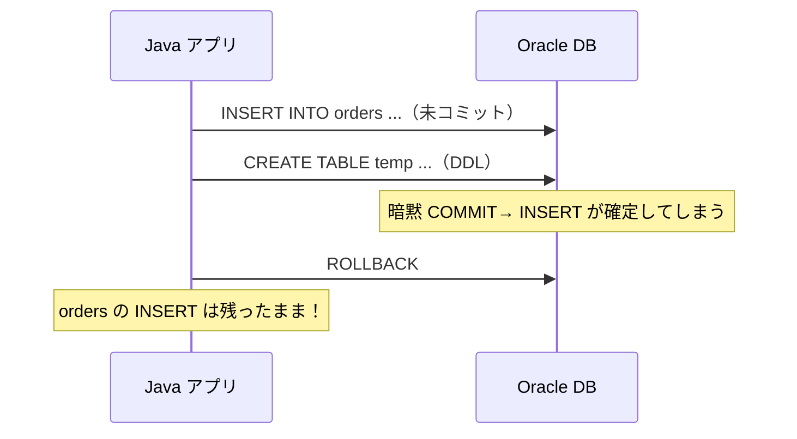
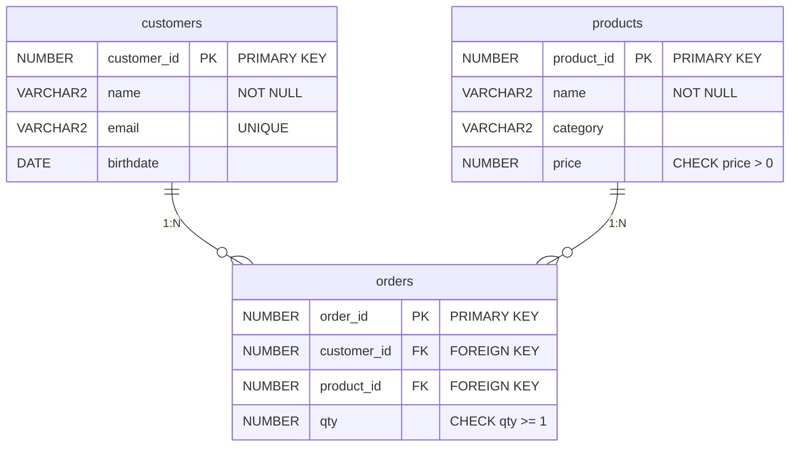
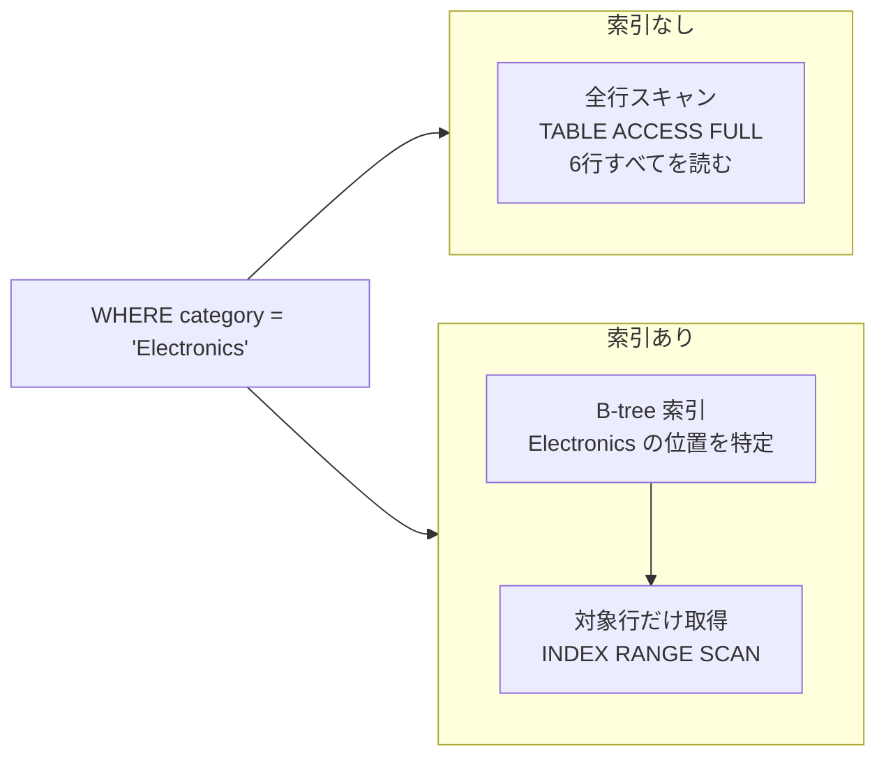
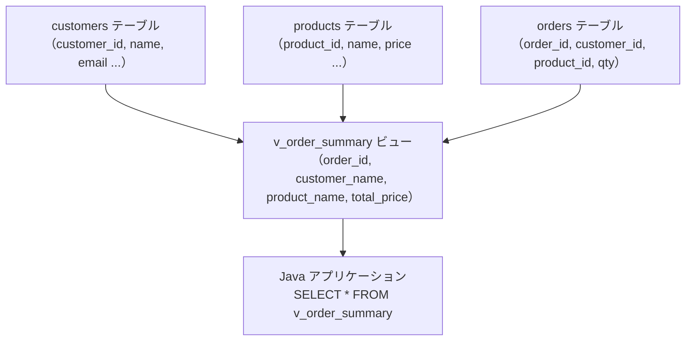

# Module 7: オブジェクトの最適化と整合性

DDL でテーブル構造を柔軟に変更し、制約でデータの整合性を守り、索引で検索を高速化する。
ビューとシーケンスでアプリケーション開発を効率化するスキルも身につける。
このモジュールでは「良い DB 設計」に不可欠なオブジェクト管理を実機演習で体験する。

## 学習目標

- `CREATE TABLE` / `ALTER TABLE`（列の追加・変更・削除）を実行できる
- `DROP TABLE` 後に RECYCLEBIN からテーブルを復元（`FLASHBACK TABLE`）できる
- `NOT NULL` / `PRIMARY KEY` / `UNIQUE` / `FOREIGN KEY` / `CHECK` の5種類の制約を定義できる
- `ENABLE` / `DISABLE CONSTRAINT` で制約を動的に切り替えられる
- B-tree 索引を作成し、`EXPLAIN PLAN` で `TABLE ACCESS FULL` と `INDEX RANGE SCAN` の違いを確認できる
- ビューを作成し、`WITH READ ONLY` の意味を説明できる
- シーケンスを作成し、`NEXTVAL` / `CURRVAL` を `INSERT` で活用できる

---

## 第19章: DDL（表の作成と管理）

DDL（Data Definition Language）はテーブルなどのオブジェクトを作成・変更・削除する命令群です。
`CREATE`・`ALTER`・`DROP`・`TRUNCATE` が代表的な DDL です。

### テーブルの作成

```sql
CREATE TABLE customers (
  customer_id NUMBER(5)     CONSTRAINT pk_customers       PRIMARY KEY,
  name        VARCHAR2(50)  CONSTRAINT nn_customers_name  NOT NULL,
  email       VARCHAR2(100) CONSTRAINT uq_customers_email UNIQUE,
  birthdate   DATE,
  created_at  DATE          DEFAULT SYSDATE
);
```

`DEFAULT SYSDATE` は挿入時に値が省略された場合にサーバーの現在日時を自動設定します。

### 列の追加・変更・削除

```sql
-- 列を追加する
ALTER TABLE customers ADD (phone VARCHAR2(20));

-- 列のデータ型を変更する（既存データと互換性がある場合のみ可能）
ALTER TABLE customers MODIFY (phone VARCHAR2(30));

-- 列を削除する
ALTER TABLE customers DROP COLUMN phone;
```

### TRUNCATE と DELETE の違い

どちらもデータを削除しますが、仕組みが大きく異なります。

| 操作 | 種別 | ROLLBACK | HWM | 速度 |
| :--- | :--- | :--- | :--- | :--- |
| `DELETE FROM t` | DML | 可能 | リセットされない | 遅い |
| `TRUNCATE TABLE t` | DDL | 不可 | リセットされる | 速い |

`TRUNCATE` は DDL なので実行前後に暗黙 COMMIT が走ります。ロールバックできないため、本番環境では慎重に使う必要があります。

### DDL の暗黙 COMMIT（Java 開発者向け注意点）

Oracle では DDL を実行すると、**実行前後に自動的に COMMIT が行われます**。
Java アプリケーションで DML と DDL を同じトランザクション内に混在させると、意図しない COMMIT が発生します。



### DROP TABLE と RECYCLEBIN

`DROP TABLE` はデフォルトでテーブルを **RECYCLEBIN** に移動します。
誤って削除した場合は `FLASHBACK TABLE` で復元できます。

```sql
-- テーブルを削除する（RECYCLEBIN に移動）
DROP TABLE temp_test;

-- RECYCLEBIN の中身を確認する
SHOW RECYCLEBIN

-- 削除前の状態に復元する
FLASHBACK TABLE temp_test TO BEFORE DROP;

-- 完全削除（復元不可）
DROP TABLE temp_test PURGE;
```

`PURGE` を付けて削除するか、`PURGE RECYCLEBIN` で RECYCLEBIN を空にすると完全に削除されます。

---

## 第20章: 制約（データ整合性の番人）

制約（Constraint）はテーブルに格納できるデータの条件を定義します。
アプリケーション層だけでなく DB 層でもデータの整合性を保証できるため、DBA・開発者双方にとって重要な機能です。



### 5種類の制約

| 制約 | 役割 | 発生するエラー |
| :--- | :--- | :--- |
| `NOT NULL` | NULL を禁止する | ORA-01400 |
| `PRIMARY KEY` | 一意性 + NOT NULL（テーブルに1つだけ） | ORA-00001 |
| `UNIQUE` | 一意性を強制する（NULL は許容） | ORA-00001 |
| `FOREIGN KEY` | 参照先テーブルに存在する値のみ受け入れる | ORA-02291 |
| `CHECK` | 任意の条件を指定する（副問合せは使えない） | ORA-02290 |

### 制約に名前を付ける理由

制約に名前を付けると、エラーメッセージからどの制約が違反したかをすぐに特定できます。

```sql
-- 名前なしの場合: ORA-00001: 一意制約 (OBJ_USER.SYS_C0012345) に反しています
-- 名前ありの場合: ORA-00001: 一意制約 (OBJ_USER.UQ_CUSTOMERS_EMAIL) に反しています
```

命名規則の例: `pk_テーブル名`（主キー）、`fk_テーブル名_列名`（外部キー）、`chk_テーブル名_条件`（CHECK）

### DISABLE / ENABLE CONSTRAINT

データの一括ロード中など、一時的に制約を無効化したい場合があります。

```sql
-- 制約を無効化する
ALTER TABLE orders DISABLE CONSTRAINT fk_orders_customer;

-- 制約を有効化する（既存データが制約を満たしていることが条件）
ALTER TABLE orders ENABLE CONSTRAINT fk_orders_customer;
```

> **ENABLE 時の注意**
>
> `DISABLE` 中に制約に違反するデータを挿入すると、`ENABLE` の際に ORA-02298 が発生します。
> `ENABLE` の前に矛盾データを削除または修正する必要があります。

### ON DELETE CASCADE / ON DELETE SET NULL

外部キー制約では、参照先の行が削除されたときの動作を指定できます。

```sql
CONSTRAINT fk_orders_customer
  REFERENCES customers(customer_id) ON DELETE CASCADE
  -- 顧客を削除すると注文も自動削除される
```

| オプション | 動作 |
| :--- | :--- |
| （指定なし） | 参照先の削除を禁止する（デフォルト） |
| `ON DELETE CASCADE` | 参照先を削除すると子行も自動削除する |
| `ON DELETE SET NULL` | 参照先を削除すると外部キー列を NULL にする |

---

## 第21章: 索引（検索を速くする仕組み）

索引（インデックス）は書籍の巻末索引と同じ仕組みです。
索引がなければ全ページ（全行）を読む必要がありますが、索引があればキーワードのページ（行の場所）を直接参照できます。



### 索引の作成と削除

```sql
-- B-tree索引を作成する（最も一般的な索引型）
CREATE INDEX idx_products_category ON products(category);

-- 索引を削除する
DROP INDEX idx_products_category;
```

`PRIMARY KEY` と `UNIQUE` 制約には Oracle が自動的に索引を作成します。

### EXPLAIN PLAN で実行計画を確認する

`EXPLAIN PLAN FOR` に続けて SQL を記述すると、オプティマイザが選んだ実行計画を確認できます。

```sql
EXPLAIN PLAN FOR
  SELECT * FROM products WHERE category = 'Electronics';

SELECT * FROM TABLE(DBMS_XPLAN.DISPLAY);
```

出力例（索引なし）。

```text
---------------------------------------------------------------------------
| Id | Operation         | Name     | Rows | Cost |
---------------------------------------------------------------------------
|  0 | SELECT STATEMENT  |          |    3 |    3 |
|* 1 |  TABLE ACCESS FULL| PRODUCTS |    3 |    3 |
---------------------------------------------------------------------------
```

出力例（索引あり）。

```text
-------------------------------------------------------------------------------------------
| Id | Operation                   | Name                   | Rows | Cost |
-------------------------------------------------------------------------------------------
|  0 | SELECT STATEMENT            |                         |    3 |    2 |
|  1 |  TABLE ACCESS BY INDEX ROWID| PRODUCTS                |    3 |    2 |
|* 2 |   INDEX RANGE SCAN          | IDX_PRODUCTS_CATEGORY   |    3 |    1 |
-------------------------------------------------------------------------------------------
```

> **データ件数が少い場合の注意**
>
> Oracle のオプティマイザは統計情報を基に最も効率的な実行計画を選びます。
> テーブルの件数が少ない場合、索引を使うより全件スキャンの方が速いと判断し、`TABLE ACCESS FULL` を選ぶことがあります。
> ヒント句 `/*+ INDEX(table_name index_name) */` で索引の使用を強制できます。

### 索引が使われない代表的なケース

| パターン | 索引 | 理由 |
| :--- | :--- | :--- |
| `WHERE name = 'Alice'` | 使われる | 通常の等値比較 |
| `WHERE UPPER(name) = 'ALICE'` | 使われない | 列に関数適用 |
| `WHERE name LIKE '%alice'` | 使われない | 前方ワイルドカード |
| `WHERE price \|\| '' = '100'` | 使われない | 型変換が発生 |

`UPPER(name)` のような関数を使う検索が多い場合は**関数ベース索引**を作成します。

```sql
CREATE INDEX idx_customers_upper_name ON customers(UPPER(name));
```

---

## 第22章: ビュー

ビューは SELECT 文を「仮想テーブル」として名前を付けて保存したものです。
データはビュー自体には格納されず、参照するたびに元のテーブルから取得します。

### ビューを使う理由

- **セキュリティ**: 機密列（給与・個人情報）を隠して特定の列だけ公開できる
- **複雑な SQL の隠蔽**: JOIN や集計を含む SQL をシンプルな SELECT に見せられる
- **アプリケーションとの分離**: テーブル構造を変更してもビューの定義を更新すれば影響を局所化できる



```sql
-- 複数テーブルを結合したビューを作成する
CREATE OR REPLACE VIEW v_order_summary AS
SELECT o.order_id,
       c.name          customer_name,
       p.name          product_name,
       o.qty * p.price total_price,
       o.order_date
FROM orders o
JOIN customers c ON o.customer_id = c.customer_id
JOIN products  p ON o.product_id  = p.product_id;

-- アプリケーションはシンプルな SELECT で利用できる
SELECT * FROM v_order_summary WHERE total_price > 10000;
```

### WITH READ ONLY

更新を禁止したいビューには `WITH READ ONLY` を指定します。

```sql
CREATE OR REPLACE VIEW v_products_electronics AS
SELECT product_id, name, price
FROM products
WHERE category = 'Electronics'
WITH READ ONLY;
```

`WITH READ ONLY` のビューに `INSERT` / `UPDATE` / `DELETE` を実行すると ORA-42399 が発生します。

### ビューの更新可否

| 条件 | 更新可否 |
| :--- | :--- |
| 1テーブル・集計なし・グループ化なし | 更新可（シンプルビュー） |
| JOIN を含む・集計関数を使う | 更新不可 |
| `WITH READ ONLY` を指定 | 更新不可（明示的に禁止） |

---

## 第23章: シーケンス・タイムゾーン

### シーケンス

シーケンス（SEQUENCE）は連番を自動生成するオブジェクトです。
テーブルの主キー値を発番する際によく使います。Java の `AtomicLong` に相当します。

```sql
-- シーケンスを作成する
CREATE SEQUENCE seq_order_id
  START WITH 1001      -- 開始値
  INCREMENT BY 1       -- 増加幅
  NOCACHE              -- キャッシュなし（再起動後も連番が保証される）
  NOCYCLE;             -- 最大値に達してもエラー（ループしない）
```

| オプション | 説明 |
| :--- | :--- |
| `START WITH n` | 最初に発番される値 |
| `INCREMENT BY n` | 増加幅（負の値で減少シーケンスも作れる） |
| `CACHE n` / `NOCACHE` | 性能向上のために n 個を先読みする（インスタンス再起動でギャップが生じる） |
| `CYCLE` / `NOCYCLE` | 最大値到達後に最小値へ折り返すか否か |

### NEXTVAL と CURRVAL の使い方

```sql
-- NEXTVAL: 次の値を発番する（呼ぶたびに増加）
INSERT INTO orders (order_id, customer_id, product_id, qty)
VALUES (seq_order_id.NEXTVAL, 5, 3, 1);

-- CURRVAL: 現在のセッションで最後に発番した値を確認する
SELECT seq_order_id.CURRVAL FROM dual;
```

> **NEXTVAL と ROLLBACK**
>
> `ROLLBACK` を実行しても NEXTVAL で発番した値は戻りません。
> `1001` を発番して INSERT し ROLLBACK すると、次の NEXTVAL は `1002` になります。
> シーケンスは「ギャップが生じる可能性がある連番」として設計されています。

### CACHE vs NOCACHE のトレードオフ

| 設定 | メリット | デメリット |
| :--- | :--- | :--- |
| `CACHE 20` | 先読みでパフォーマンスが向上する | インスタンス再起動時に未使用の先読み値が失われる |
| `NOCACHE` | 連番のギャップが発生しない | 発番のたびにディスク I/O が発生する（低速） |

高トランザクション環境では `CACHE` を使い、監査などで連番の欠番が許容されない要件では `NOCACHE` を選びます。

### タイムゾーン

グローバル展開するアプリケーションではタイムゾーンの考慮が必要です。

```sql
-- タイムゾーン情報を保持する列型
CREATE TABLE events (
  event_id   NUMBER,
  event_time TIMESTAMP WITH TIME ZONE,
  local_time TIMESTAMP WITH LOCAL TIME ZONE
);

-- 挿入時にタイムゾーンを指定する
INSERT INTO events VALUES (1,
  TIMESTAMP '2024-04-01 09:00:00 Asia/Tokyo',
  TIMESTAMP '2024-04-01 09:00:00 Asia/Tokyo');
```

| 型 | 説明 |
| :--- | :--- |
| `DATE` | 日時のみ（タイムゾーンなし） |
| `TIMESTAMP` | マイクロ秒精度（タイムゾーンなし） |
| `TIMESTAMP WITH TIME ZONE` | タイムゾーンオフセットを保持する |
| `TIMESTAMP WITH LOCAL TIME ZONE` | DB サーバーのタイムゾーンに変換して保存する |

---

## ハンズオン

### Step 1: サンプルスキーマを作成する

`SYSDBA` として接続し、`obj_user` スキーマに3テーブルとサンプルデータを作成します。

```bash
sqlplus / as sysdba @/workspaces/starter-oracle-db/module-07-objects/setup-schema.sql
```

完了後、各テーブルの行数が表示されます（customers: 5行、products: 6行、orders: 8行）。

---

### Step 2: ALTER TABLE（列の追加・変更・削除）

```bash
sqlplus obj_user/ObjUser#1@localhost:1521/xepdb1
```

```sql
-- phone 列を追加する
ALTER TABLE customers ADD (phone VARCHAR2(20));
DESCRIBE customers

-- 列を拡張する
ALTER TABLE customers MODIFY (phone VARCHAR2(30));

-- 列を削除する
ALTER TABLE customers DROP COLUMN phone;
DESCRIBE customers
```

---

### Step 3: DROP TABLE と RECYCLEBIN

```sql
-- テスト用テーブルを作成して削除する
CREATE TABLE temp_test (id NUMBER, memo VARCHAR2(50));
INSERT INTO temp_test VALUES (1, 'テスト');
COMMIT;

DROP TABLE temp_test;
SHOW RECYCLEBIN

-- FLASHBACK で復元する
FLASHBACK TABLE temp_test TO BEFORE DROP;
SELECT * FROM temp_test;

-- 完全削除する
DROP TABLE temp_test PURGE;
```

---

### Step 4: 索引と EXPLAIN PLAN の比較

```sql
-- 索引なしで実行計画を確認する（TABLE ACCESS FULL）
EXPLAIN PLAN FOR
  SELECT product_id, name, price FROM products WHERE category = 'Electronics';
SELECT * FROM TABLE(DBMS_XPLAN.DISPLAY);

-- B-tree索引を作成する
CREATE INDEX idx_products_category ON products(category);

-- 索引ありで実行計画を確認する（INDEX RANGE SCAN）
EXPLAIN PLAN FOR
  SELECT /*+ INDEX(products idx_products_category) */
    product_id, name, price FROM products WHERE category = 'Electronics';
SELECT * FROM TABLE(DBMS_XPLAN.DISPLAY);
```

`TABLE ACCESS FULL` → `INDEX RANGE SCAN` に変わることを確認します。

---

### Step 5: ビューの作成と WITH READ ONLY

```sql
-- JOIN を含む注文サマリービューを作成する
CREATE OR REPLACE VIEW v_order_summary AS
SELECT o.order_id, c.name customer_name,
       p.name product_name, o.qty * p.price total_price
FROM orders o
JOIN customers c ON o.customer_id = c.customer_id
JOIN products  p ON o.product_id  = p.product_id;

SELECT * FROM v_order_summary ORDER BY order_id;

-- WITH READ ONLY ビューを作成する
CREATE OR REPLACE VIEW v_products_electronics AS
SELECT product_id, name, price FROM products
WHERE category = 'Electronics'
WITH READ ONLY;

-- UPDATE で ORA-42399 が発生することを確認する
UPDATE v_products_electronics SET price = 99999 WHERE product_id = 1;
```

---

### Step 6: 制約違反のデモ

別のスクリプトで5種類の制約違反と DISABLE/ENABLE CONSTRAINT を実機確認します。

```bash
sqlplus obj_user/ObjUser#1@localhost:1521/xepdb1 \
  @/workspaces/starter-oracle-db/module-07-objects/constraint-sequence-demo.sql
```

以下のエラーが順番に発生することを確認します。

| 操作 | 発生エラー |
| :--- | :--- |
| name=NULL で INSERT | ORA-01400（NOT NULL 違反） |
| 既存 PK で INSERT | ORA-00001（PRIMARY KEY 違反） |
| 存在しない FK で INSERT | ORA-02291（FOREIGN KEY 違反） |
| price=-1 で INSERT | ORA-02290（CHECK 違反） |
| DISABLE 後に不正 FK を INSERT して ENABLE | ORA-02298（整合性違反データあり） |

---

### Step 7: シーケンスの作成と INSERT

上記スクリプトの後半でシーケンスの動作を確認します。

```sql
-- シーケンスを作成して INSERT で使う
CREATE SEQUENCE seq_order_id START WITH 2001 INCREMENT BY 1 NOCACHE NOCYCLE;

INSERT INTO orders (order_id, customer_id, product_id, qty)
VALUES (seq_order_id.NEXTVAL, 5, 3, 1);

SELECT seq_order_id.CURRVAL FROM dual;
```

---

### Step 8: クリーンアップ

```bash
sqlplus / as sysdba
```

```sql
ALTER SESSION SET CONTAINER = XEPDB1;
DROP USER obj_user CASCADE;
EXIT;
```

---

## 確認してみよう

1. `DELETE` と `TRUNCATE` の違いは何ですか？それぞれが適している場面を説明してください。
2. 5種類の制約（NOT NULL / PRIMARY KEY / UNIQUE / FOREIGN KEY / CHECK）の違いと、それぞれが必要な場面を具体例で説明してください。
3. B-tree 索引はどのような仕組みで検索を速くしますか？索引が使われない代表的なケースも説明してください。
4. `EXPLAIN PLAN` で `TABLE ACCESS FULL` と `INDEX RANGE SCAN` が表示された場合、それぞれの意味と使い分けの判断基準を説明してください。
5. `WITH READ ONLY` で作成したビューへの更新を試みるとどうなりますか？また、ビューへの更新を禁止したい場面はどのような状況ですか？

---

| [← Module 6: 開発者の一歩先を行くSQL](../module-06-sql/README.md) | [全章目次](../README.md) | 最終章 |
|:---|:---:|---:|
